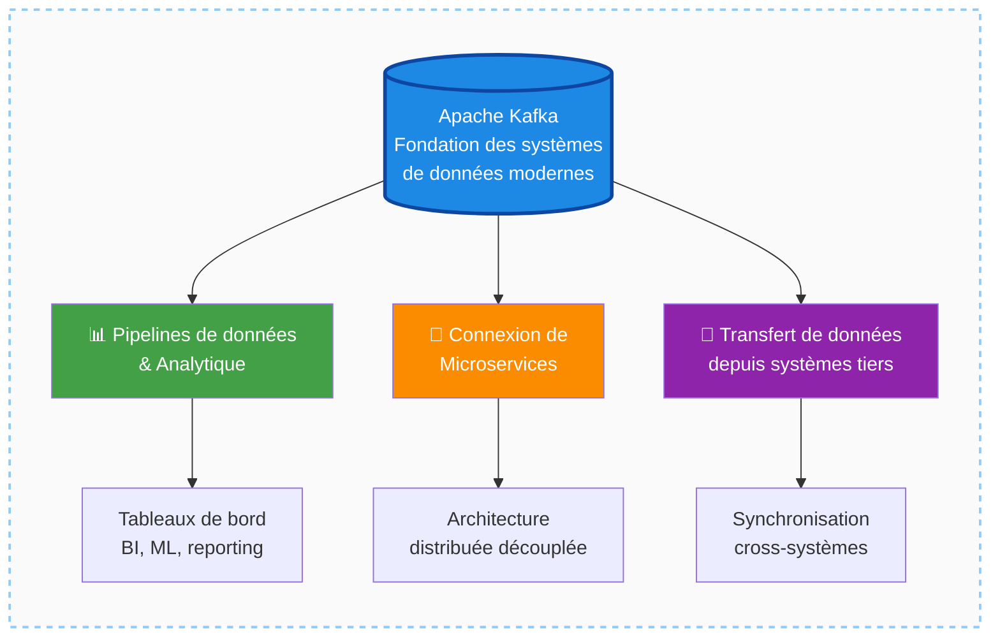
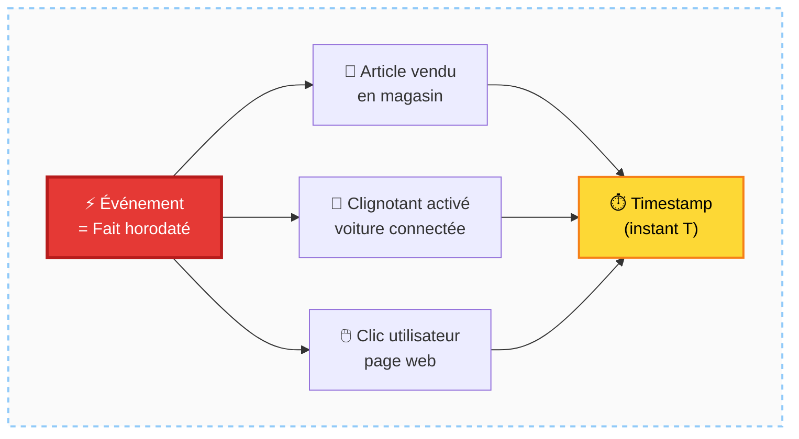
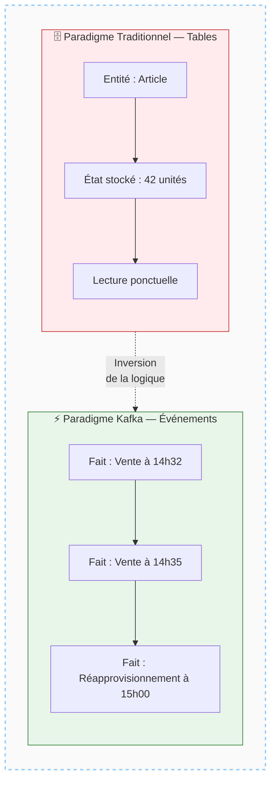
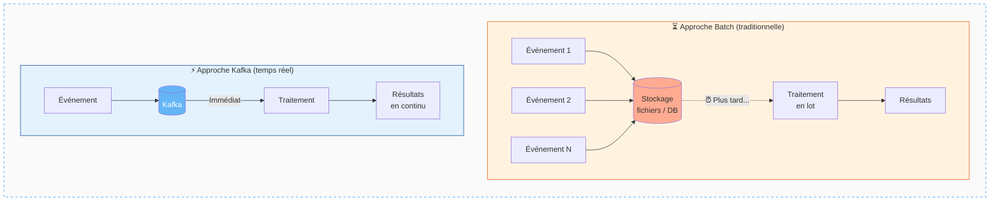
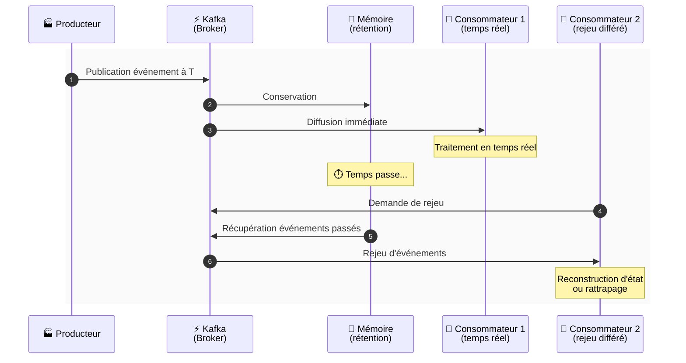
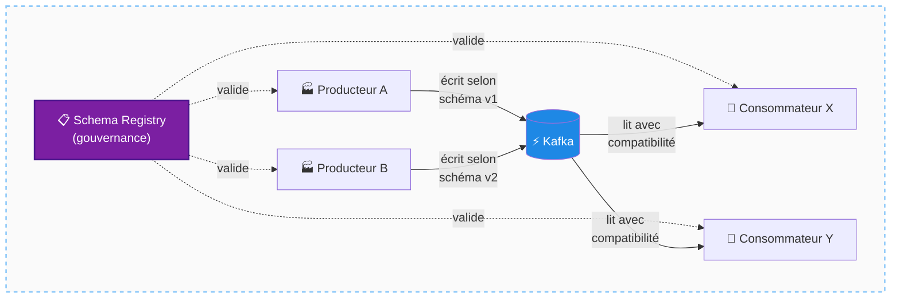
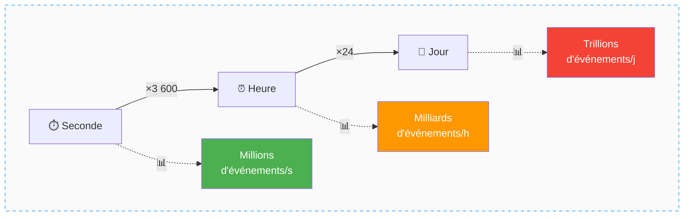
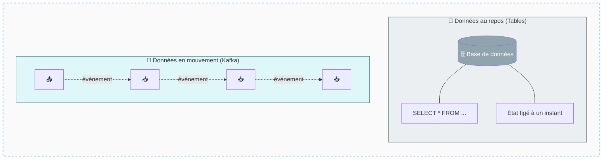
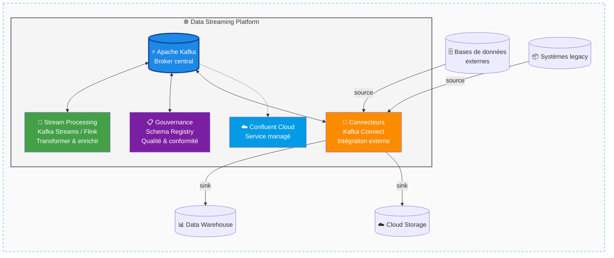
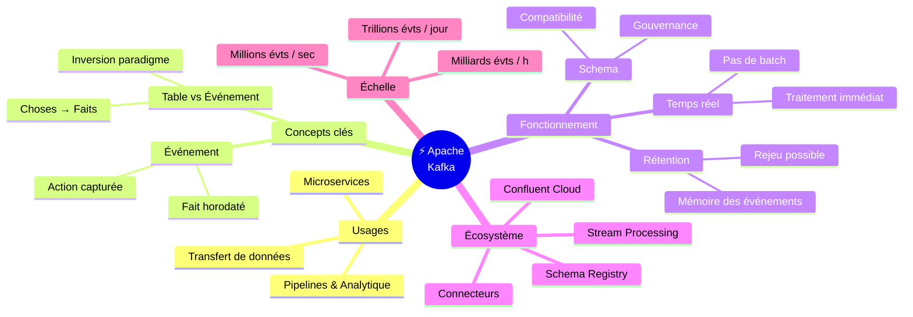

# Introduction à Apache Kafka — Tim Berglund, Confluent

## Table des matières
- [Module 1 : Introduction à Apache Kafka et à la pensée événementielle](#module-1--introduction-à-apache-kafka-et-à-la-pensée-événementielle)

---

## Module 1 : Introduction à Apache Kafka et à la pensée événementielle

### Sujet
Ce module présente Apache Kafka, son rôle dans les systèmes de données modernes, et le changement de paradigme fondamental qu'il implique : passer d'une pensée orientée *choses* (tables, entités) à une pensée orientée *événements* (faits horodatés).

---

### Concepts clés

#### Apache Kafka
Kafka est une infrastructure logicielle devenue la **fondation universelle** sur laquelle les systèmes de données modernes sont construits. Il s'adresse à trois types d'usages principaux :
- Les **pipelines de données et l'analytique**
- La **connexion de microservices** dans des architectures applicatives
- Le **transfert de données** depuis des systèmes tiers vers un système cible

##### Schéma — Les trois grands usages de Kafka

---

#### Événement (*Event*)
Un événement est un **fait qui se produit à un instant précis dans le temps**. Ce n'est pas une représentation d'une entité statique, mais la capture d'une action ou d'un changement. Exemples :
- Un article vendu dans un magasin
- Un conducteur de voiture connectée activant son clignotant
- Un utilisateur qui clique sur une page web

Les événements forment **l'épine dorsale des systèmes de données contemporains**.

##### Schéma — L'anatomie d'un événement

---

#### Table vs Événement
Le paradigme traditionnel des bases de données pousse à penser en termes de **tables**, qui stockent des représentations d'entités du monde réel (articles en inventaire, voitures connectées, utilisateurs inscrits). Kafka encourage à inverser cette logique : plutôt que de stocker l'état d'une chose, on capture **ce qui se passe**, instant par instant.

##### Schéma — Le changement de paradigme

---

### Fonctionnement

#### Traitement en temps réel
Kafka est conçu pour traiter les événements **au moment où ils se produisent**, sans les accumuler dans des tables ou des fichiers pour un traitement différé (batch). Le principe est clair : dès qu'un événement survient, le travail de traitement est effectué **immédiatement**. Il n'y a pas de logique du type "on stocke maintenant, on traite plus tard".

##### Schéma — Batch vs Temps réel

---

#### Stockage et mémoire des événements
Bien que Kafka soit orienté temps réel, il **conserve en mémoire les événements passés**. Cette capacité de rétention permet de rejouer des événements, d'alimenter des systèmes en retard, ou de reconstruire un état. Kafka n'est donc pas seulement un bus de messages éphémère.

##### Schéma — Cycle de vie d'un événement dans Kafka

---

#### Gestion du schéma (*Schema*)
Kafka intègre des mécanismes pour gérer le **schéma des événements** qu'il stocke. Cela correspond à une logique plus proche de la pensée "chose/entité" : on définit la structure des données circulant dans Kafka, ce qui facilite la gouvernance et la compatibilité entre producteurs et consommateurs.

##### Schéma — Gouvernance via le Schema Registry

---

### Cas d'usage

- **Stream processing** : réaliser des calculs en temps réel sur des flux d'événements
- **Gouvernance des données événementielles** : imposer des règles et des schémas sur les données qui transitent
- **Connectivité inter-systèmes** : relier Kafka à des systèmes tiers non-Kafka via des connecteurs
- **Pipelines à très haute volumétrie** : des entreprises traitent des millions d'événements par seconde, des milliards par heure, des trillions par jour

##### Schéma — Échelle de volumétrie de Kafka

---

### Comparaisons

| Paradigme traditionnel (Table)    | Paradigme Kafka (Événement)            |
|-----------------------------------|----------------------------------------|
| Stocke l'état actuel d'une entité | Capture un fait survenu à un instant T |
| Traitement différé (batch)        | Traitement immédiat (temps réel)       |
| Données au repos                  | Données en mouvement                   |
| Lecture ponctuelle                | Flux continu                           |

##### Schéma — Données au repos vs Données en mouvement

---

### Cas d'usage — Écosystème et plateforme

Au-delà du broker Kafka lui-même, un **écosystème complet** — appelé *data streaming platform* — s'est constitué autour de Kafka :
- Outils de **stream processing** pour transformer et enrichir les événements à la volée
- Composants de **gouvernance** pour contrôler la qualité et la conformité des données
- **Connecteurs** pour intégrer Kafka avec des systèmes externes
- Services cloud-natifs comme **Confluent Cloud**, qui offrent Kafka en tant que service managé, avec des différences notables par rapport à Apache Kafka open source

##### Schéma — La Data Streaming Platform autour de Kafka

---

### Points à retenir

- Kafka est la **fondation des systèmes de données modernes**, utilisée par de nombreuses grandes entreprises à l'échelle mondiale.
- Le changement de paradigme essentiel : penser **événements** plutôt que **choses/tables**.
- Kafka traite les événements **en temps réel**, mais peut aussi les **conserver** pour un accès ultérieur.
- La gestion du **schéma** dans Kafka est possible et importante pour la gouvernance.
- Il existe une distinction entre **Apache Kafka** (open source) et les **services Kafka cloud-natifs** comme Confluent Cloud.
- Kafka est une porte d'entrée vers un écosystème plus large : stream processing, gouvernance, connecteurs — un domaine vaste qui ne fait que commencer.

##### Schéma de synthèse — Carte mentale du Module 1

