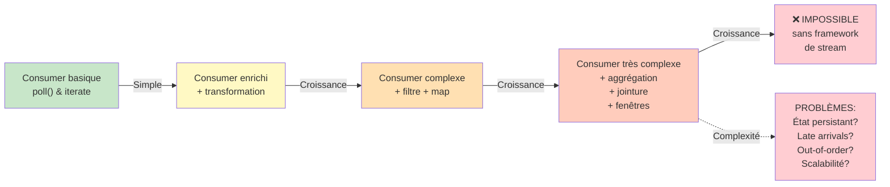
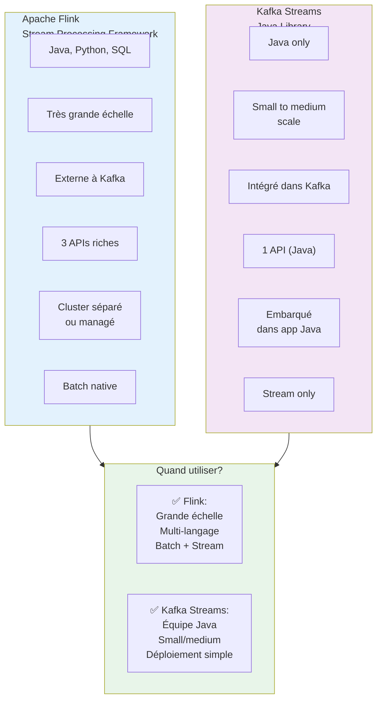
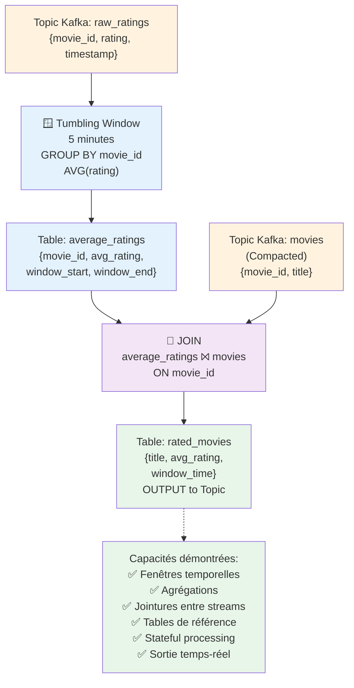
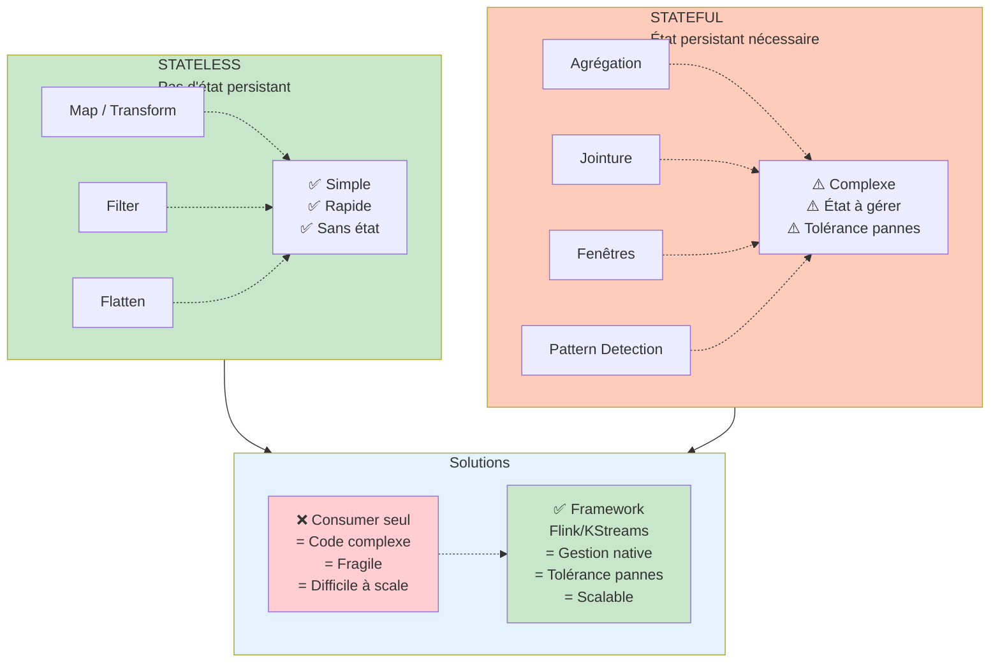
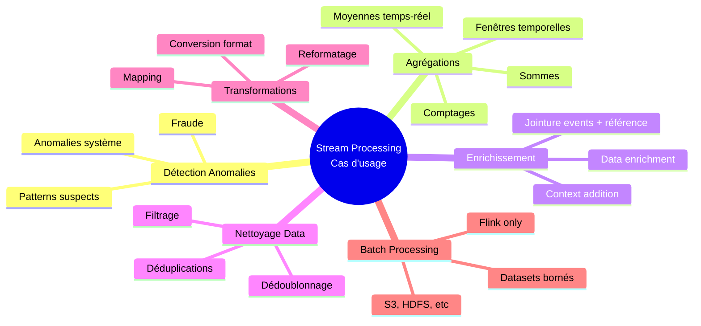
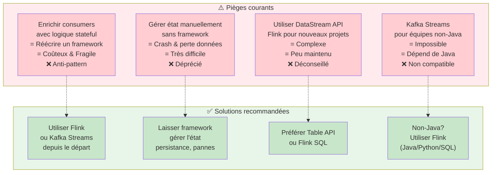

# Stream Processing — Apache Kafka

## Table des matières
- [Module 1 : Stream Processing](#module-1--stream-processing)

---

## Module 1 : Stream Processing

### Sujet

Ce module introduit le **stream processing** dans l'écosystème Apache Kafka, explique pourquoi il est nécessaire d'adopter un framework dédié plutôt que d'enrichir les consumers, et présente les deux options principales : **Apache Flink** et **Kafka Streams**.

---

### Concepts clés

#### Pourquoi ne pas tout faire dans les consumers ?

Dans une application Kafka en croissance, les consumers tendent à devenir de plus en plus complexes. Ce qui commence par de simples transformations stateless (masquage de données PII, reformatage de messages) évolue rapidement vers des opérations bien plus complexes :

- **Agrégations**
- **Enrichissements**
- **Jointures entre streams**
- **Traitement par fenêtres temporelles** (*time windows*)
- **Détection de patterns** (ex. : détection de fraude basée sur une séquence d'événements)
- **Gestion des messages en retard** (*late arriving messages*) et **hors ordre** (*out-of-order events*)

Or, l'API consumer de Kafka n'offre **aucun support natif** pour ces fonctionnalités avancées. Les implémenter soi-même reviendrait à écrire un framework entier, ce qui :
- N'est **pas le rôle du développeur applicatif** (son rôle est de délivrer de la valeur métier).
- Introduit des **problèmes de tolérance aux pannes** complexes (ex. : persistance de l'état en cas de crash).
- Est **extrêmement difficile à faire à grande échelle**.

La solution est d'adopter un **framework de stream processing dédié**.

---

### Les deux options principales

#### Apache Flink

Apache Flink est devenu le **standard de facto** pour le stream processing sur Kafka. Il fournit tous les primitives computationnels essentiels (transformation, filtrage, jointure, agrégation) sans nécessiter d'écrire du code d'infrastructure.

Flink propose **trois APIs** au choix :

```mermaid
graph TB
    Flink["Apache Flink<br/>Stream Processing Framework"]
    
    subgraph DS["DataStream API"]
        DS1["Bas niveau"]
        DS2["Historiquement première"]
        DS3["❌ Déconseillée<br/>pour nouveaux projets"]
        DS1 -.-> DS2 -.-> DS3
    end
    
    subgraph TA["Table API"]
        TA1["Haut niveau<br/>Java & Python"]
        TA2["Syntaxe fluente<br/>ressemble SQL"]
        TA3["✅ Recommandée<br/>pour nouveaux projets"]
        TA4["Croissance active"]
        TA1 -.-> TA2 -.-> TA3
        TA3 -.-> TA4
    end
    
    subgraph SQL["Flink SQL"]
        SQL1["SQL natif<br/>100% SQL standard"]
        SQL2["Parsing & Compilation"]
        SQL3["UDF support<br/>Python & Java"]
        SQL4["✅ Idéale<br/>pour tous les cas"]
        SQL1 -.-> SQL2 -.-> SQL3 -.-> SQL4
    end
    
    Flink --> DS
    Flink --> TA
    Flink --> SQL
    
    style DS fill:#ffcdd2
    style TA fill:#fff9c4
    style SQL fill:#c8e6c9
    style DS3 fill:#ff5252
    style TA3 fill:#66bb6a
    style SQL4 fill:#66bb6a
```

| API                | Niveau                      | Recommandation                                                                                                                                                                                 |
|--------------------|-----------------------------|------------------------------------------------------------------------------------------------------------------------------------------------------------------------------------------------|
| **DataStream API** | Bas niveau                  | Historiquement la première API de Flink. Toujours utilisée par certains experts, mais **déconseillée pour les nouveaux projets** car plus complexe à apprendre et moins activement développée. |
| **Table API**      | Haut niveau (Java / Python) | API fluente dont les méthodes ressemblent à des opérations SQL. Plus simple à comprendre, en croissance active. **Recommandée pour les nouveaux projets** en Java ou Python.                   |
| **Flink SQL**      | SQL natif                   | Permet d'écrire directement des requêtes SQL, qui sont parsées et transformées en jobs exécutés sur le cluster Flink. Offre toute l'expressivité de SQL pour le stream processing.             |

**Autres capacités notables de Flink :**
- Traitement de **données bornées en mode batch** (données statiques stockées en S3, etc.), avec le même code que pour le stream processing dans certains cas.
- Support des **User-Defined Functions (UDF)** appelables depuis Flink SQL, implémentables en Python ou Java.
- Détection de **doublons**.
- Adapté aux **cas d'usage à très grande échelle**.

#### Kafka Streams

Kafka Streams est une **librairie Java** incluse dans Apache Kafka open source. C'est un consumer Kafka enrichi qui intègre nativement les primitives de stream processing.

**Caractéristiques :**
- Fait partie d'**Apache Kafka open source** (pas de composant supplémentaire à déployer).
- Idéal pour les **équipes Java** qui déploient déjà des applications consommatrices Kafka.
- Dispose d'une bonne documentation, de tutoriels (dont sur Confluent Developer) et d'une communauté active.
- Bon **story de scalabilité**, mais tend à être privilégié pour des cas **small to medium scale**.

**Comparaison Flink vs Kafka Streams :**

| Critère           | Apache Flink                     | Kafka Streams                       |
|-------------------|----------------------------------|-------------------------------------|
| Langage           | Java, Python, SQL                | Java                                |
| Échelle           | Très grande échelle              | Small à medium scale                |
| Intégration Kafka | Externe                          | Native (fait partie d'Apache Kafka) |
| APIs disponibles  | DataStream, Table, SQL           | API Streams (Java)                  |
| Déploiement       | Cluster Flink séparé (ou managé) | Embarqué dans l'application Java    |

Les deux options sont **valides et activement utilisées** en production.

---

### Fonctionnement — Exemple Flink SQL

L'exemple suivant illustre un pipeline de stream processing complet en Flink SQL sur des données de ratings de films en temps réel :

1. **Source** : Un topic Kafka `raw_ratings` contient des évaluations de films en streaming (movie ID, rating, timestamp).
2. **Table intermédiaire** : Une table `average_ratings` calcule la **moyenne des ratings par film** sur une **fenêtre glissante de 5 minutes** (*tumbling window*), groupée par `movie_id`.
3. **Table de référence** : Un topic Kafka `movies` (topic compacté contenant des entités plutôt que des événements) mappe les `movie_id` aux noms de films.
4. **Jointure** : Une jointure entre `average_ratings` et `movies` produit une table `rated_movies` avec les **titres de films et leurs notes moyennes** en temps réel.

Ce pipeline illustre plusieurs capacités clés : fenêtres temporelles, jointures entre streams, utilisation de topics compactés comme tables de référence.

---

### Opérations Stateless vs Stateful

---

### Cas d'usage

- **Détection de fraude** : corrélation de séquences d'événements pour identifier des patterns suspects.
- **Agrégations en temps réel** : calcul de moyennes, sommes, comptages sur des fenêtres de temps.
- **Enrichissement de données** : jointure d'un stream d'événements avec une table de référence.
- **Dédoublonnage** : détection et suppression de messages dupliqués dans un stream.
- **Reformatage et filtrage** : transformation légère de messages avant leur consommation.
- **Traitement batch** : avec Flink, traitement de datasets bornés (S3, etc.) avec le même code que le stream processing.

---

### Mises en garde

- **Ne pas enrichir indéfiniment les consumers** pour gérer de la logique stateful : cela revient à réécrire un framework de stream processing, ce qui est coûteux en temps et fragile.
- Les opérations **stateful** (agrégations, jointures) introduisent des problèmes de **tolérance aux pannes** (persistance de l'état en cas de crash) qui sont résolus nativement par Flink et Kafka Streams, mais très difficiles à gérer manuellement.
- La **DataStream API de Flink** est déconseillée pour les nouveaux projets : préférer la Table API ou Flink SQL.
- Kafka Streams est **limité au langage Java** : les équipes non-Java devront se tourner vers Flink.

---

### Points à retenir

```mermaid
graph TB
    SP["<b>Stream Processing</b><br/>Pilier essentiel Kafka"]
    
    subgraph Essential["Essentiels"]
        E1["✅ Incontournable<br/>au-delà de stateless"]
        E2["✅ Gère état natif<br/>avec tolérance pannes"]
        E3["✅ Scalable<br/>grande échelle"]
    end
    
    subgraph Flink["Apache Flink"]
        F1["Standard de facto"]
        F2["3 APIs:<br/>DataStream ❌<br/>Table API ✅<br/>Flink SQL ✅"]
        F3["Multi-langage:<br/>Java, Python, SQL"]
        F4["Batch + Stream"]
        F5["Grande échelle"]
    end
    
    subgraph KStreams["Kafka Streams"]
        K1["Librairie Java"]
        K2["Intégrée à Kafka<br/>open source"]
        K3["1 API fluente"]
        K4["Équipes Java"]
        K5["Small/medium scale"]
    end
    
    subgraph Choice["Quand choisir?"]
        Choice1["Flink:<br/>Complexité +++<br/>Échelle très grande<br/>Multi-langage"]
        Choice2["Kafka Streams:<br/>Complexité +<br/>Équipe Java<br/>Small/medium"]
        Choice3["Les deux sont<br/>viables<br/>en production"]
    end
    
    subgraph Cloud["Cloud"]
        Cloud1["Flink managé<br/>Confluent Cloud<br/>Zéro ops"]
    end
    
    SP --> Essential
    SP --> Flink
    SP --> KStreams
    Flink --> Choice
    KStreams --> Choice
    SP --> Cloud
    
    style SP fill:#e3f2fd
    style Essential fill:#c8e6c9
    style Flink fill:#fff9c4
    style KStreams fill:#f3e5f5
    style Choice fill:#e8f5e9
    style Cloud fill:#b2dfdb
```

- Le **stream processing est incontournable** dès que les opérations dépassent de simples transformations stateless.
- **Apache Flink** est le standard de facto pour le stream processing sur Kafka, avec trois APIs (DataStream, Table, SQL) et un support natif du mode batch.
- **Kafka Streams** est une librairie Java intégrée à Apache Kafka, idéale pour les équipes Java sur des charges small à medium scale.
- **Flink SQL** permet d'écrire des pipelines de stream processing en SQL pur, avec support des UDF, des fenêtres temporelles, des jointures et de la détection de doublons.
- Les deux frameworks (Flink et Kafka Streams) sont des **options viables et complémentaires** selon le contexte.
- Flink est disponible en **mode entièrement managé sur Confluent Cloud**, sans gestion de cluster.