# Apache Kafka — Les Topics

## Table des matières
- [Module 1 : Les Topics Kafka](#module-1--les-topics-kafka)

---

## Module 1 : Les Topics Kafka

### Sujet
Ce module introduit le concept fondamental de **topic** dans Kafka, en le comparant au modèle tabulaire traditionnel des bases de données. Il explique la structure des messages, les propriétés des logs immuables, et les implications pratiques de ce paradigme pour la modélisation des données.

---

### Concepts clés

#### Table vs Log
Dans une base de données traditionnelle, les données sont stockées dans des **tables**. Chaque entité du monde réel (ex. : un thermostat) occupe une ligne, et quand l'état de cette entité change, on **met à jour la ligne**. Le problème : on **perd le contexte historique**. Si la température de la cuisine passe de 22°C à 24°C, la valeur précédente disparaît. Il devient impossible de répondre à des questions comme : à quelle vitesse la cuisine chauffe-t-elle ? À quelle heure de la journée ?

Kafka repose sur un modèle radicalement différent : le **log**. Un log est une **séquence ordonnée de messages**. On y ajoute des éléments à la fin, et on ne modifie jamais ce qui y a déjà été écrit. Chaque changement dans le monde est enregistré comme un **nouvel événement**, préservant ainsi tout l'historique.

##### Schéma — Table (UPDATE) vs Log (APPEND)

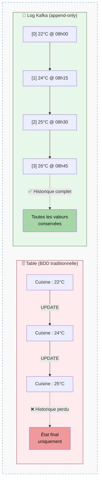

---

#### Topic
Dans Kafka, les logs s'appellent des **topics**. Un topic est l'endroit où sont stockés les messages. On peut en avoir des milliers dans un même cluster Kafka, chacun dédié à un type de données ou à un usage particulier — à l'image des tables dans une base de données.

##### Schéma — Un cluster Kafka contient plusieurs topics

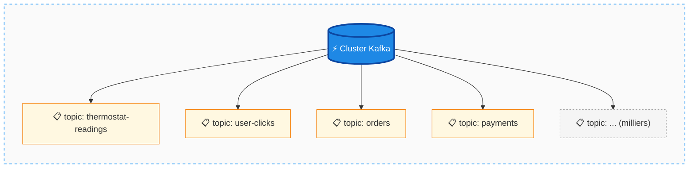

---

#### Immutabilité des messages
C'est une caractéristique **définissante** de Kafka : une fois qu'un message est écrit dans un topic, il est **immuable**. On ne peut pas le modifier. On peut l'oublier (le supprimer après expiration), mais pas le changer. Un événement s'est produit, il fait partie de l'histoire.

##### Schéma — Le principe d'immutabilité

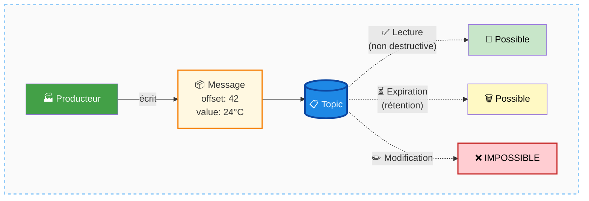

---

#### Log vs Queue
Un topic Kafka n'est **pas une queue**. La différence est fondamentale :
- Dans une **queue**, lire un message le consomme et le retire : plus personne ne peut le lire.
- Dans un **log**, lire un message ne le supprime pas : il reste disponible, peut être relu, et d'autres consommateurs peuvent y accéder indépendamment.

Cette distinction a des implications très larges sur l'architecture des systèmes.

##### Schéma — Queue (consommation destructive) vs Log Kafka (lecture partagée)

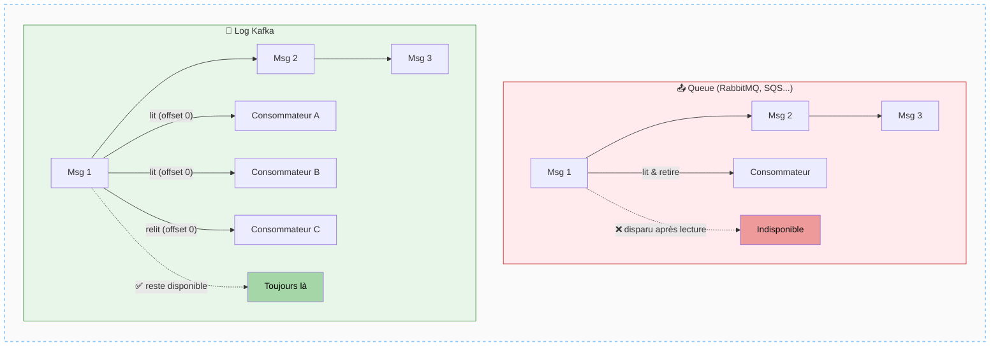

---

### Fonctionnement

#### Ajout de messages
Les messages sont toujours **ajoutés à la fin** du topic (append-only). Dans l'exemple du thermostat, chaque nouvelle lecture de capteur génère un nouveau message dans le topic `thermostat-readings`. Si la cuisine passe de 22°C à 24°C, un nouveau message est ajouté — l'ancien reste intact. On dispose ainsi de **l'historique complet** des relevés.

##### Schéma — Append-only sur un topic thermostat

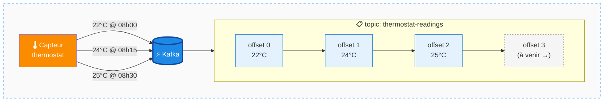

---

#### Schema et format
Kafka est **totalement agnostique au format** des données. Internalement, les messages sont de simples **tableaux d'octets** (*bytes*). Kafka ne connaît pas le schéma. En pratique, on utilise des formats comme :
- **JSON** (lisible, souvent utilisé en développement)
- **Avro** (compact, avec gestion de schéma)
- **Protocol Buffers** (Protobuf)
- Tout format de sérialisation personnalisé

La gestion des schémas se fait en dehors du broker Kafka, via des outils dédiés (ex. : Schema Registry).

##### Schéma — Sérialisation et formats

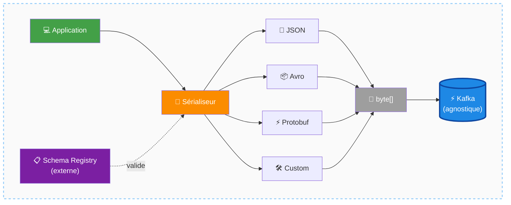

---

#### Transformation de topics immuables
Puisque les messages sont immuables, pour transformer des données, on **crée de nouveaux topics**. Par exemple, pour ne garder que les relevés de température élevée, on lit le topic source, on applique un filtre (ex. via une requête SQL de stream processing), et on écrit les résultats dans un second topic `hot-locations`. C'est la manière standard de travailler avec des données immuables.

##### Schéma — Pipeline de transformation entre topics

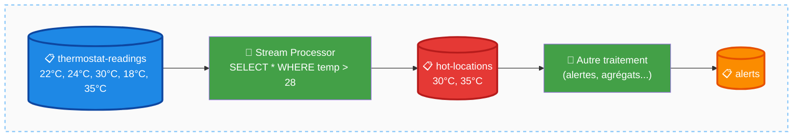

---

### Structure d'un message Kafka

Un message Kafka est composé des champs suivants :

| Champ         | Obligatoire             | Description                                                                                                                                                                                                      |
|---------------|-------------------------|------------------------------------------------------------------------------------------------------------------------------------------------------------------------------------------------------------------|
| **Value**     | ✅ Oui                   | Le contenu principal de l'événement — le *quoi*. Peut être JSON, Avro, Protobuf, une chaîne, un entier, etc.                                                                                                     |
| **Key**       | ❌ Non (mais recommandé) | Identifiant logique de l'entité concernée (ex. : ID du capteur, ID utilisateur). Utilisée pour distribuer les données efficacement entre les partitions du cluster. Doit être choisie avec soin.                 |
| **Timestamp** | Automatique             | Représente le *quand* de l'événement. Peut être défini par le producteur (temps de l'événement réel) ou assigné automatiquement par le broker à la réception.                                                    |
| **Headers**   | ❌ Non                   | Map de paires clé-valeur en chaînes de caractères non typées. Utilisée pour des **métadonnées légères** sur le message (ex. : source, contexte de traçabilité). Ne pas utiliser comme vecteur de données métier. |
| **Topic**     | Automatique             | Le topic auquel appartient le message.                                                                                                                                                                           |
| **Offset**    | Automatique             | Identifiant séquentiel du message dans le topic. Commence à 0, incrémenté de 1 à chaque nouveau message. Simple et immuable.                                                                                     |

##### Schéma — Anatomie d'un message Kafka

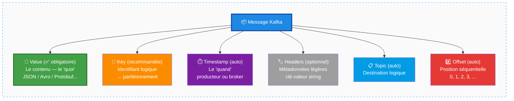

---

### Cas d'usage

- **Historisation continue** : capturer tous les états successifs d'un équipement (thermostat, capteur IoT) sans perdre l'historique
- **Audit trail** : conserver un journal immuable de toutes les actions effectuées dans un système
- **Fan-out** : plusieurs consommateurs lisent indépendamment le même topic sans interférence (impossible avec une queue)
- **Transformation en pipeline** : enchaîner des topics pour filtrer, enrichir ou agréger des données via le stream processing

##### Schéma — Le pattern Fan-out (un topic, plusieurs consommateurs indépendants)

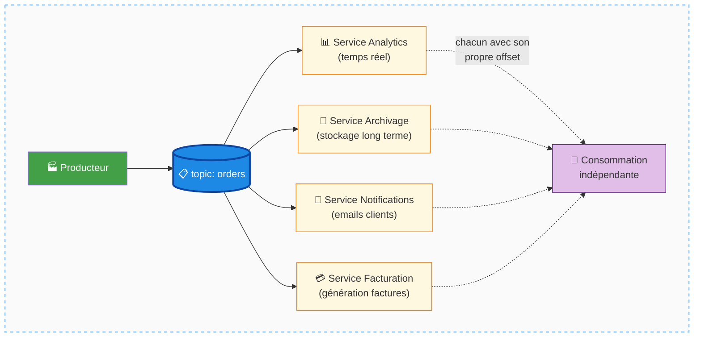

---

### Mises en garde

- **Ne pas confondre topic et queue** : Kafka n'a pas de queues. Utiliser le terme "Kafka queue" est une erreur conceptuelle. Les topics sont des logs, et cette distinction a des conséquences architecturales majeures.
- **La clé doit être choisie avec soin** : elle détermine la distribution des messages entre les partitions. Un mauvais choix de clé peut créer des déséquilibres de charge dans le cluster.
- **L'immuabilité est absolue** : toute logique de "mise à jour" doit être repensée sous forme d'ajout d'un nouvel événement ou de création d'un topic transformé.
- **Kafka est schema-less** : sans outil de gestion de schéma (ex. Schema Registry), des incompatibilités entre producteurs et consommateurs peuvent survenir silencieusement.

##### Schéma — Les 4 pièges à éviter

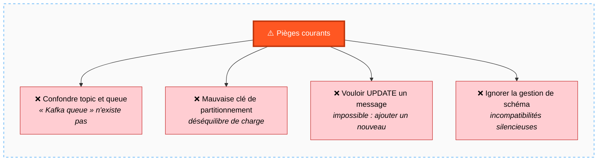

---

### Points à retenir

- Un **topic** est un log immuable et ordonné de messages — l'équivalent Kafka d'une table, mais fondamentalement différent dans son comportement.
- Les messages sont **immuables** : on ne les modifie jamais, on ajoute toujours à la fin.
- Un topic **n'est pas une queue** : les messages restent disponibles après lecture et peuvent être consommés plusieurs fois par des consommateurs distincts.
- La structure d'un message comprend : **value** (obligatoire), **key** (recommandée), **timestamp**, **headers**, **topic** et **offset**.
- Pour transformer des données, on crée de **nouveaux topics** à partir de l'existant — c'est le principe de base du stream processing.
- Kafka est **agnostique au format** : JSON, Avro, Protobuf ou tout autre format sont valables, la gestion du schéma étant externalisée.

##### Schéma de synthèse — Carte mentale du module Topics

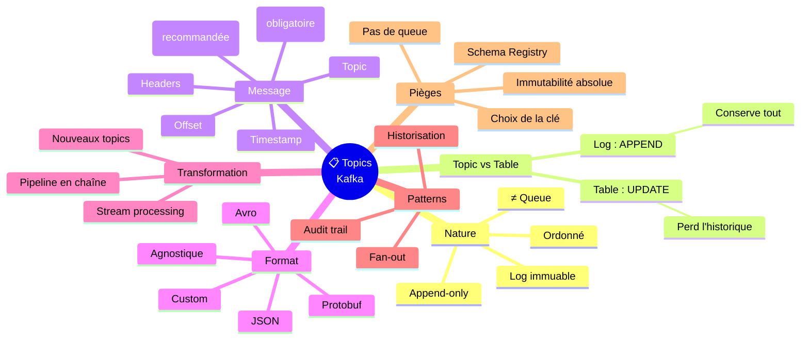

