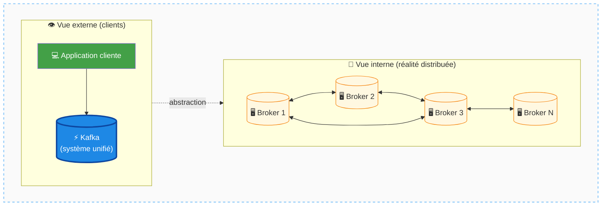
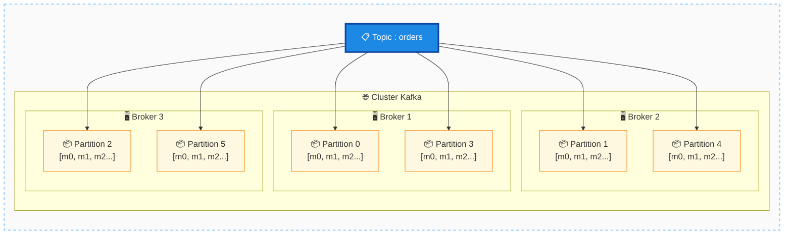
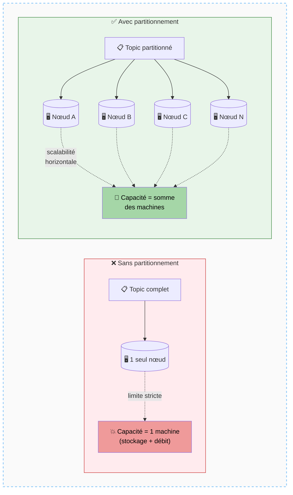
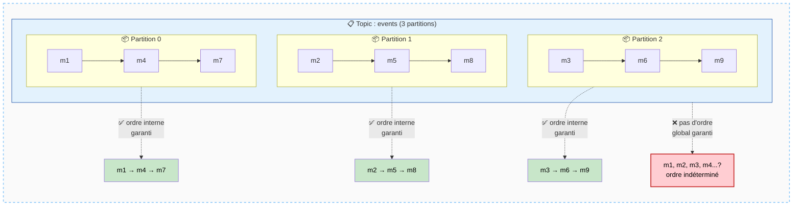
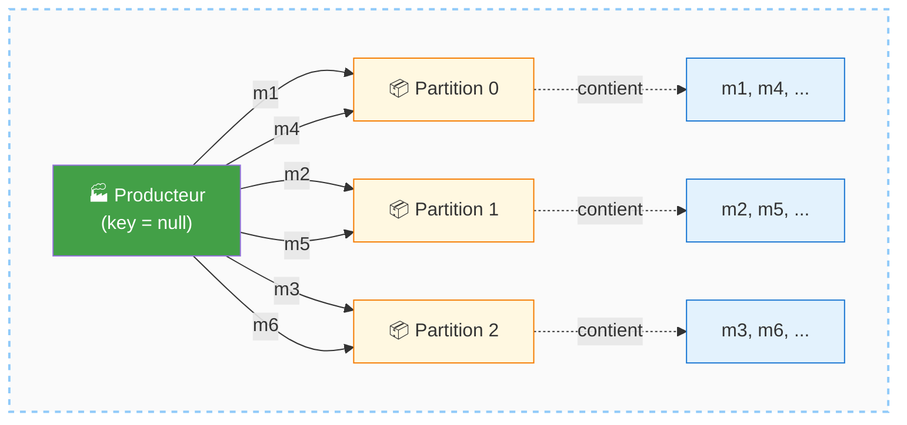
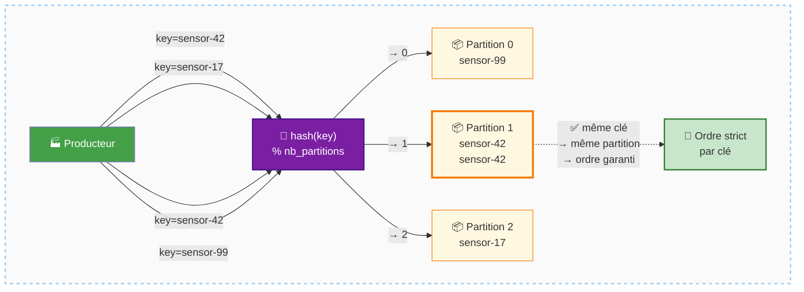
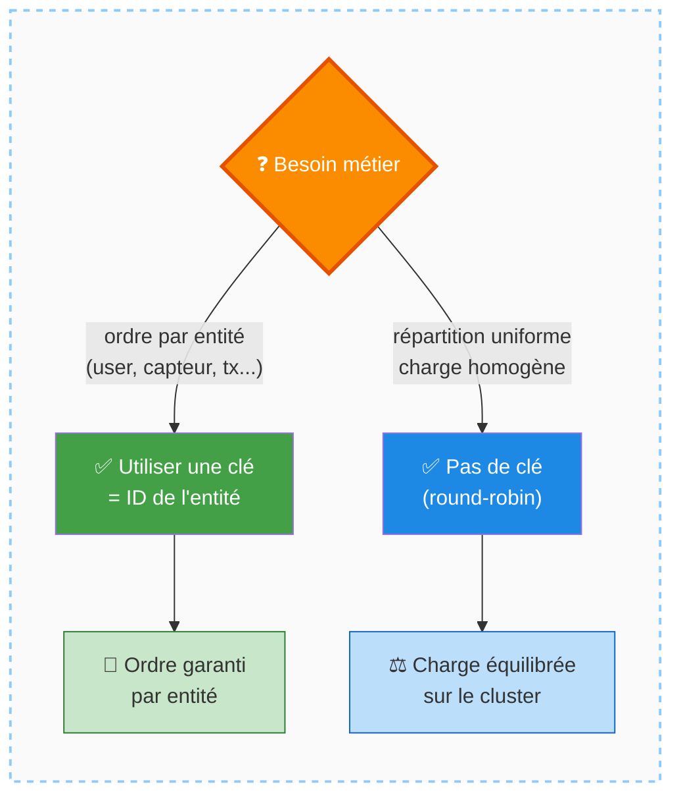
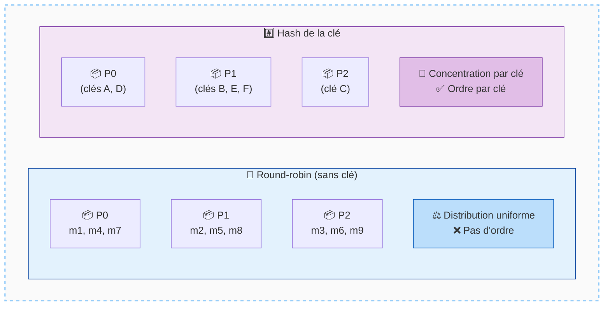
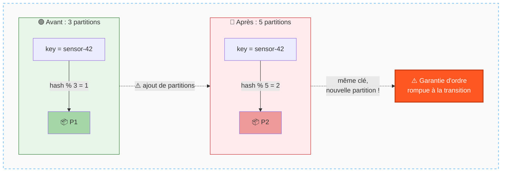
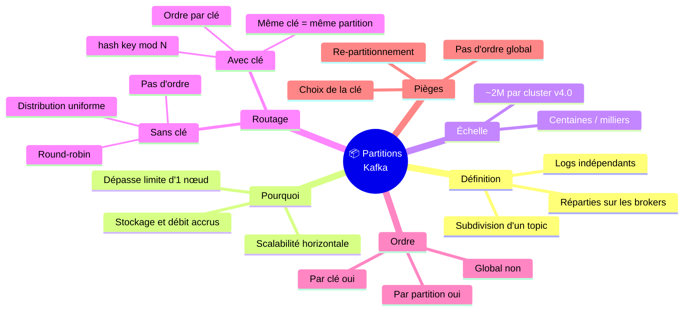

# Apache Kafka — Partitions

## Table des matières
- [Module 1 : Kafka Partitions — Scalabilité et distribution des messages](#module-1--kafka-partitions--scalabilité-et-distribution-des-messages)

---

## Module 1 : Kafka Partitions — Scalabilité et distribution des messages

### Sujet

Ce module introduit le concept de **partition** dans Apache Kafka, en expliquant pourquoi ce mécanisme est fondamental pour la scalabilité d'un système distribué, et comment il influence le routage et l'ordonnancement des messages.

---

### Concepts clés

#### Kafka en tant que système distribué

Kafka est conçu pour fonctionner sur un ensemble de machines (un cluster), tout en apparaissant comme un système unifié de l'extérieur. Cette architecture distribuée impose des contraintes sur la manière dont les données sont stockées et organisées.

##### Schéma — Cluster Kafka : vue interne vs vue externe

<div align="center">



</div>

---

#### Partition

Une **partition** est une subdivision d'un topic Kafka. Au lieu de stocker l'intégralité des messages d'un topic sur une seule machine, Kafka découpe ce topic en plusieurs **logs indépendants** (les partitions), qui peuvent être répartis sur différents nœuds du cluster.

- Un topic peut avoir **des centaines ou des milliers de partitions**.
- Apache Kafka (autour de la version 4.0 au moment du cours) supporte environ **2 millions de partitions** au total dans un cluster.

##### Schéma — Un topic découpé en plusieurs partitions réparties sur le cluster

<div align="center">



</div>

---

### Fonctionnement

#### Pourquoi partitionner ?

Sans partitionnement, un topic serait contraint de tenir entièrement sur **un seul nœud**. Cela imposerait une limite stricte à la capacité de stockage et de débit, égale à celle de la machine la plus grande du cluster. Le partitionnement supprime cette contrainte en permettant à un topic de s'étendre sur plusieurs machines.

##### Schéma — Sans partitions vs Avec partitions

<div align="center">



</div>

---

#### Impact sur l'ordre des messages

Le partitionnement a un effet direct sur l'**ordonnancement des messages** :

- Il n'existe **pas d'ordre global garanti** au sein d'un topic partitionné.
- L'ordre n'est garanti qu'**au sein d'une même partition** : les messages écrits dans une partition donnée en sont lus dans le même ordre.

##### Schéma — Ordre garanti par partition, pas globalement

<div align="center">



</div>

---

#### Routage des messages vers les partitions

Chaque message doit être affecté à une partition précise. Le mécanisme de routage dépend de la présence ou non d'une **clé de message** (les messages Kafka sont des paires clé-valeur) :

**1. Message sans clé (clé `null`)**

Les messages sont distribués en **round-robin** entre les partitions : chaque nouveau message est assigné à la partition suivante dans la rotation. La charge est ainsi répartie uniformément. En revanche, **l'ordre n'est pas garanti** entre les messages d'un même producteur, car des messages successifs peuvent atterrir dans des partitions différentes.

> Exemple : les messages du thermostat 42, envoyés sans clé, sont dispersés sur plusieurs partitions — leur ordre de lecture ne reflète pas nécessairement leur ordre d'écriture.

##### Schéma — Distribution round-robin (sans clé)

<div align="center">



</div>

---

**2. Message avec clé**

Lorsqu'un message possède une clé (ex. : un identifiant de capteur), Kafka applique une **fonction de hachage** sur cette clé, puis effectue un **modulo par le nombre de partitions** pour déterminer la partition cible :

```
partition = hash(clé) % nombre_de_partitions
```

Tous les messages partageant la même clé sont ainsi toujours écrits dans **la même partition**, ce qui garantit leur **ordre strict de traitement**. Des messages de clés différentes peuvent être assignés à n'importe quelle partition selon le résultat du hash.

##### Schéma — Routage par hash de la clé

<div align="center">



</div>

---

### Cas d'usage

- **Traitement ordonné par entité** : utiliser l'identifiant d'un capteur, d'un utilisateur ou d'une transaction comme clé de message garantit que tous les événements liés à cette entité sont traités dans l'ordre, quelle que soit la vitesse de production.
- **Distribution de charge** : l'absence de clé permet une répartition homogène des messages sur toutes les partitions, idéale quand l'ordre n'a pas d'importance.

##### Schéma — Choisir entre ordre par entité et distribution uniforme

<div align="center">



</div>

---

### Comparaisons

| Critère | Sans clé (round-robin) | Avec clé (hash) |
|---|---|---|
| Distribution | Uniforme sur toutes les partitions | Concentrée sur une partition par clé |
| Ordre garanti | Non | Oui, pour les messages de même clé |
| Cas d'usage typique | Logs génériques, événements indépendants | Événements par entité (capteur, utilisateur…) |

##### Schéma — Comparaison visuelle round-robin vs hash

<div align="center">



</div>

---

### Mises en garde

- Sans clé, **l'ordre des messages d'un même producteur n'est pas garanti**, même s'il existe une tendance générale (les messages plus anciens tendent à se trouver plus tôt dans une partition).
- Le partitionnement par clé garantit l'ordre **uniquement pour les messages partageant la même clé**. Des messages de clés différentes peuvent être entremêlés dans des ordres quelconques.
- Le nombre de partitions étant fixé à la création du topic (ou modifiable avec précaution), le résultat du hash peut changer si le nombre de partitions évolue, ce qui peut redistribuer les clés vers de nouvelles partitions.

##### Schéma — Effet d'une modification du nombre de partitions

<div align="center">



</div>

---

### Points à retenir

- Les **partitions** sont le mécanisme fondamental qui rend Kafka **scalable** : elles permettent à un topic de dépasser les limites d'un seul nœud.
- L'**ordre des messages est garanti uniquement au sein d'une partition**, pas à l'échelle du topic entier.
- **Sans clé** → distribution round-robin, pas d'ordre garanti.
- **Avec clé** → hash de la clé mod nombre de partitions → ordre garanti pour les messages de même clé.
- Kafka supporte jusqu'à ~**2 millions de partitions** par cluster (v4.0).

##### Schéma de synthèse — Carte mentale du module Partitions

<div align="center">



</div>
