# Apache Kafka — Introduction aux Brokers

## Table des matières
- [Module 1 : Les Brokers Kafka](#module-1--les-brokers-kafka)

---

## Module 1 : Les Brokers Kafka

### Sujet

Ce module introduit les brokers Apache Kafka : ce qu'ils sont physiquement, leur rôle dans l'architecture Kafka, et leur évolution récente avec la suppression de ZooKeeper.

---

### Concepts clés

**Broker**
Un broker est une machine (serveur physique, instance cloud, Raspberry Pi, etc.) qui exécute le processus serveur Kafka (une JVM). C'est l'unité de base de l'infrastructure Kafka. Chaque broker héberge des partitions et traite les requêtes de lecture et d'écriture des clients.

##### Schéma — Anatomie d'un broker

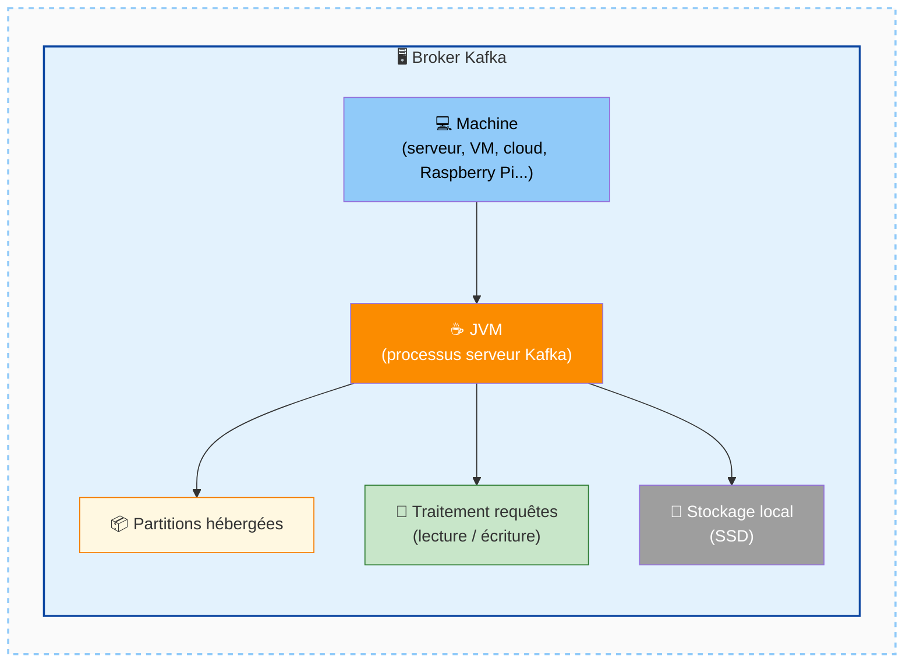

---

**Cluster Kafka**
Un ensemble de brokers interconnectés forme un cluster Kafka. Un cluster typique contient plusieurs brokers (ex. : trois), ce qui permet la distribution de la charge et la réplication des données.

##### Schéma — Cluster Kafka : plusieurs brokers interconnectés

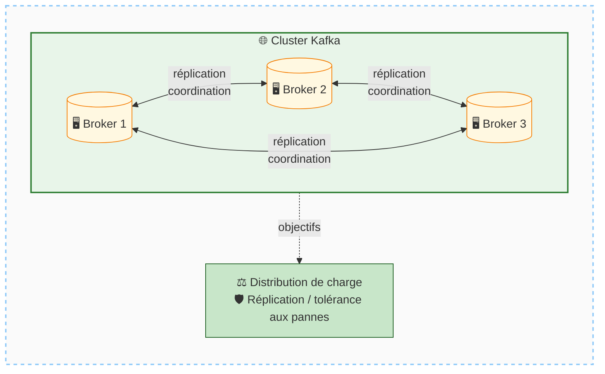

---

**Stockage local (local storage)**
Historiquement, les brokers sont étroitement couplés à un stockage local — généralement des SSDs situés physiquement à proximité du processeur. Ce couplage fort est une caractéristique importante d'Apache Kafka open-source.

##### Schéma — Couplage broker / stockage local

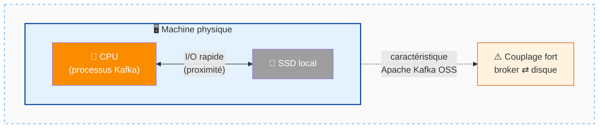

---

**KRaft (Kafka Raft)**
Protocole interne à Kafka, basé sur l'algorithme Raft, qui permet aux brokers de maintenir eux-mêmes une vue cohérente des métadonnées du cluster. Il remplace ZooKeeper depuis Apache Kafka 4.0.

##### Schéma — Avant ZooKeeper vs Après KRaft

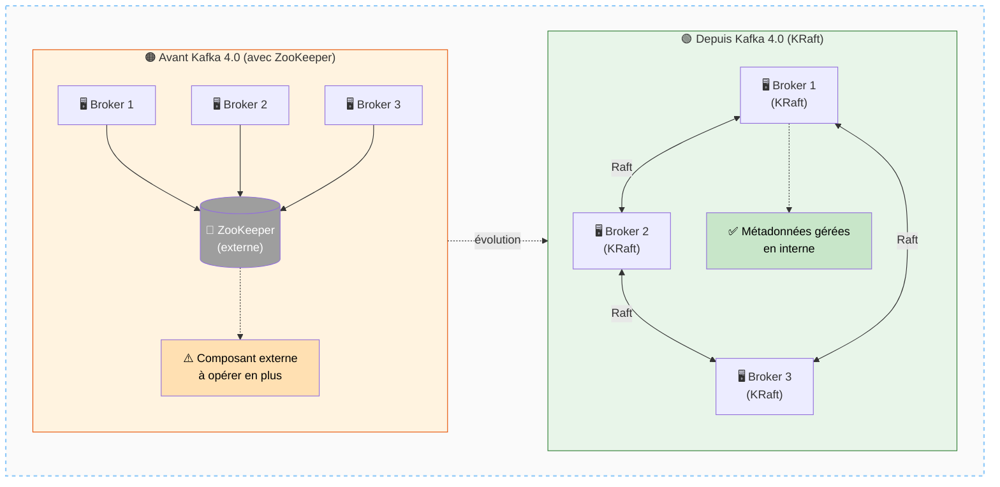

---

### Fonctionnement

**Démarrage d'un broker**
Il suffit de télécharger le tarball Apache Kafka, de le décompresser, et d'exécuter le script fourni pour lancer le processus JVM. Il est également possible d'utiliser une image Docker standard et de composer un groupe de brokers via Docker Compose — chaque conteneur constituant alors un broker distinct.

##### Schéma — Deux façons de démarrer des brokers

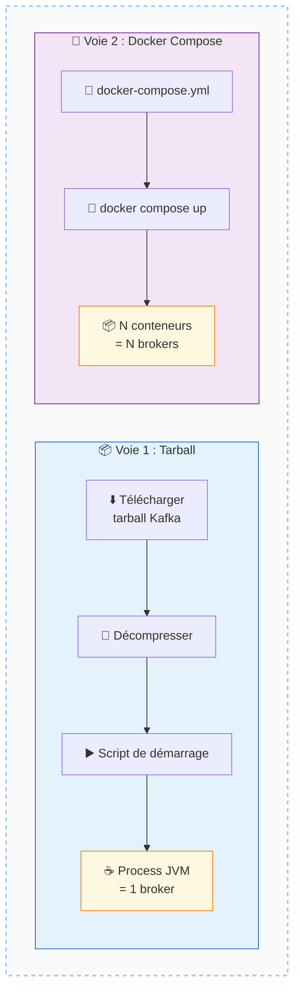

---

**Distribution des partitions sur les brokers**
Chaque broker héberge une ou plusieurs partitions. Lorsqu'un topic possède trois partitions et que le cluster contient trois brokers, chaque broker prend en charge une partition. Si un topic n'a que deux partitions, seuls deux brokers hébergent des partitions pour ce topic. Cette distribution est le mécanisme central de la scalabilité de Kafka.

##### Schéma — Distribution des partitions selon leur nombre

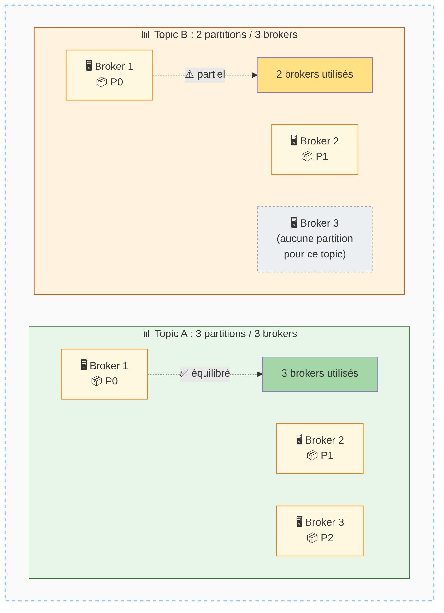

---

**Traitement des requêtes**
Les brokers reçoivent et traitent les requêtes entrantes des applications clientes : écriture de nouveaux messages dans les partitions et lecture de messages depuis les partitions. Ils effectuent les opérations d'I/O réelles sur les logs de partitions.

##### Schéma — Flux de requêtes producteur / consommateur

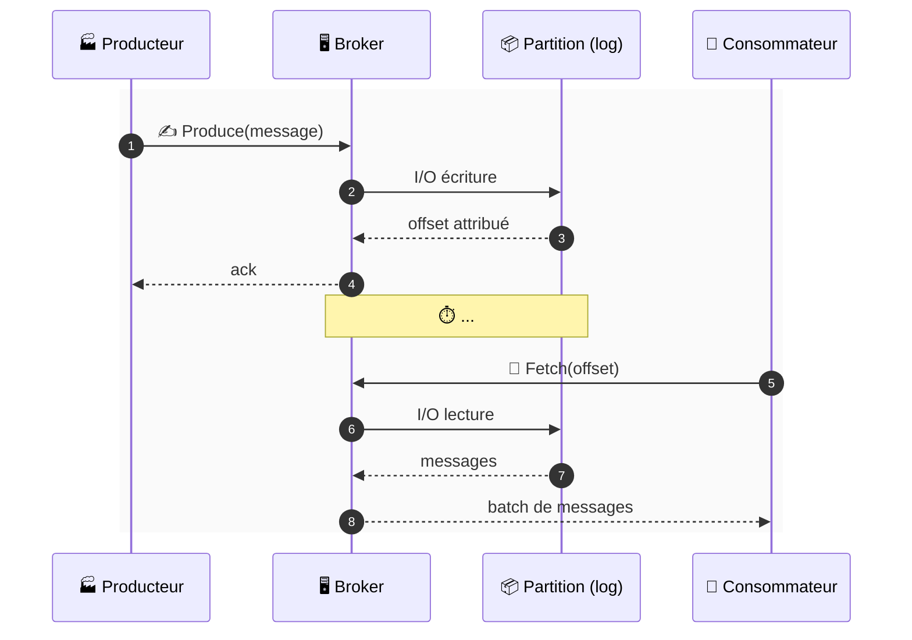

---

**Gestion de la réplication**
Les brokers sont également responsables de la réplication des données entre eux, ce qui assure la tolérance aux pannes (sujet abordé dans le module suivant).

##### Schéma — Réplication entre brokers

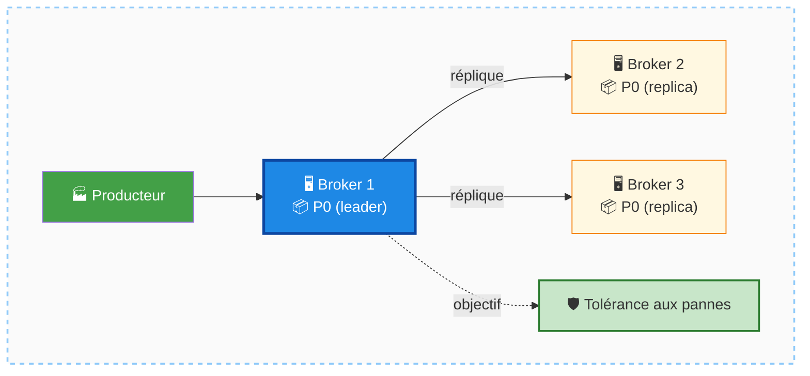

---

**Gestion des métadonnées avec KRaft**
Depuis Apache Kafka 4.0, les brokers assurent eux-mêmes la cohérence des métadonnées du cluster grâce à leur propre implémentation du protocole Raft, appelée KRaft. Cette fonctionnalité était auparavant assurée par Apache ZooKeeper.

##### Schéma — KRaft : consensus interne sur les métadonnées

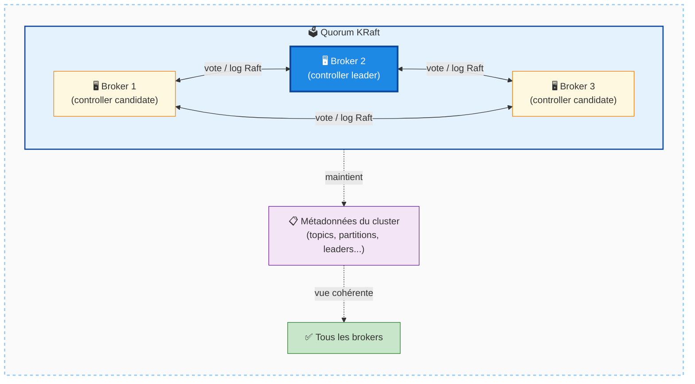

---

### Cas d'usage

Les brokers sont particulièrement visibles et importants dans les contextes suivants :
- Lancement en local pour le développement ou les tests.
- Déploiement autogéré d'Apache Kafka (on-premise ou cloud self-managed).
- Apprentissage des fondamentaux de Kafka, même si l'on prévoit d'utiliser ensuite un service managé.

Dans les services cloud managés comme Confluent Cloud, les brokers sont entièrement abstraits : l'utilisateur interagit uniquement avec les topics, messages et connecteurs. La notion de broker disparaît de l'interface.

##### Schéma — Visibilité des brokers selon le contexte

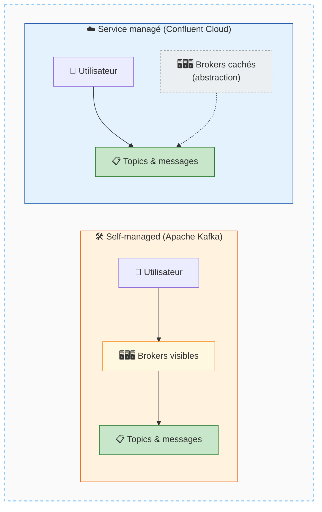

---

### Comparaisons

| Aspect                    | Apache Kafka (self-managed)          | Confluent Cloud (managé)        |
|---------------------------|--------------------------------------|---------------------------------|
| Visibilité des brokers    | Totale — à configurer et administrer | Aucune — entièrement abstraits  |
| Stockage                  | Local (SSD couplé)                   | Géré par le fournisseur         |
| Gestion des métadonnées   | KRaft (depuis v4.0)                  | Transparente pour l'utilisateur |
| Complexité opérationnelle | Élevée                               | Faible                          |

##### Schéma — Comparaison synthétique self-managed vs managé

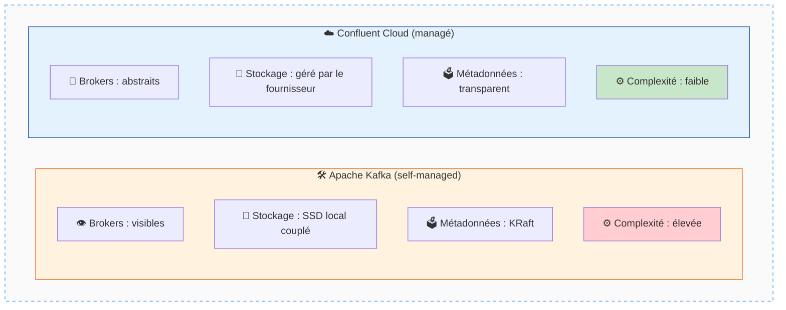

---

### Mises en garde

- **ZooKeeper est obsolète** : depuis Apache Kafka 4.0, ZooKeeper n'est plus inclus ni supporté. Toute documentation ou ressource faisant référence à ZooKeeper est donc dépassée. Il ne faut plus en tenir compte pour les nouvelles installations.
- **Connaissance des brokers utile même sans les opérer** : même si l'on utilise uniquement un service managé, comprendre les abstractions de base (brokers, partitions, réplication) reste nécessaire pour bien utiliser Kafka.

##### Schéma — Pièges à éviter

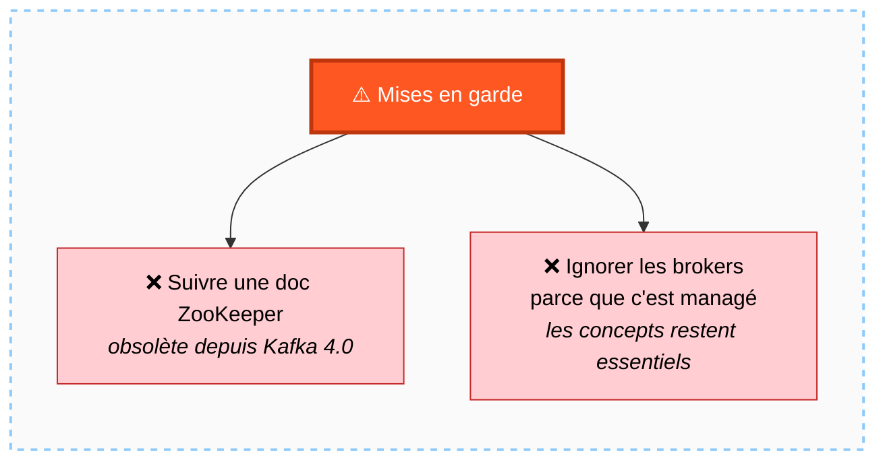

---

### Points à retenir

- Un **broker** = une machine exécutant le processus serveur Kafka, avec stockage local.
- Plusieurs brokers forment un **cluster Kafka**.
- Les brokers hébergent des **partitions**, traitent les requêtes clients (lecture/écriture) et gèrent la **réplication**.
- Le nombre de partitions par topic est configurable indépendamment selon les besoins de scalabilité.
- Depuis **Apache Kafka 4.0**, ZooKeeper est supprimé : les brokers utilisent **KRaft** pour la gestion des métadonnées.
- Dans les services cloud managés (ex. Confluent Cloud), les brokers sont invisibles pour l'utilisateur final.

##### Schéma de synthèse — Carte mentale du module Brokers

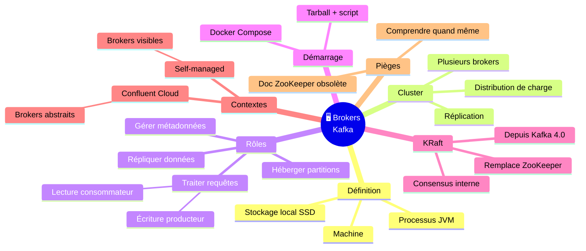

