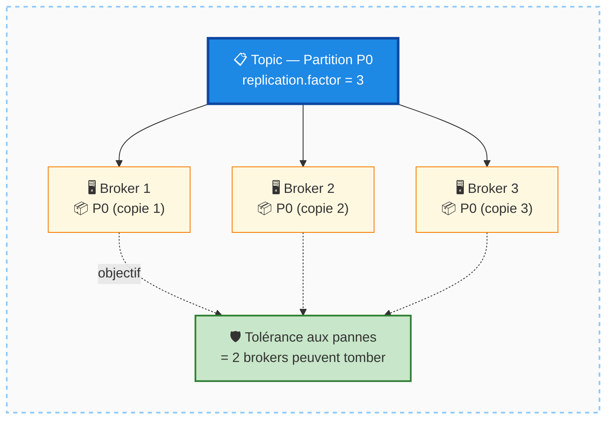
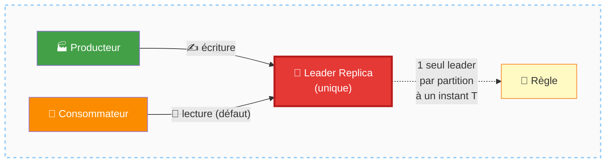
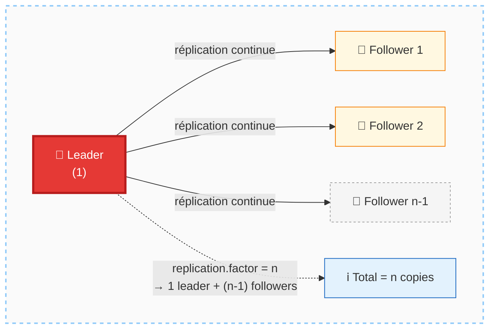
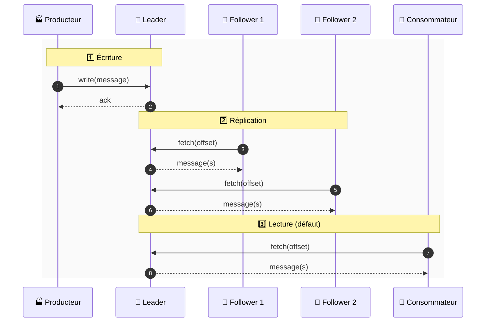
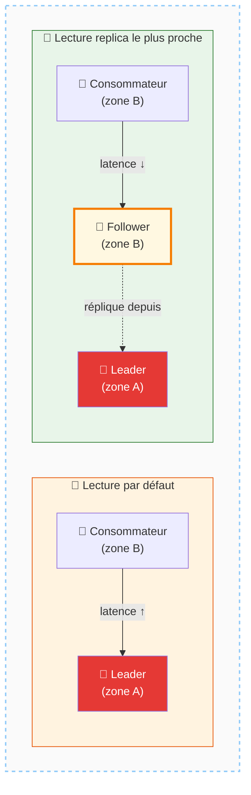
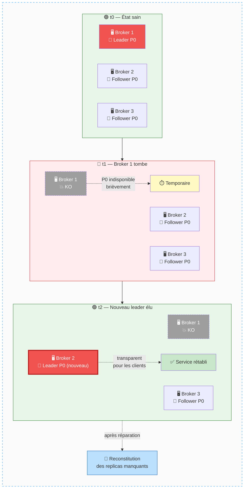
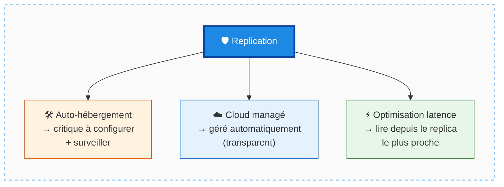
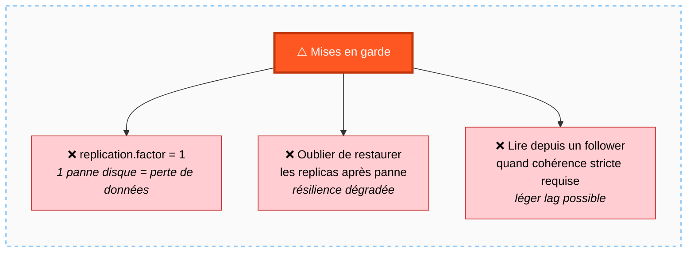
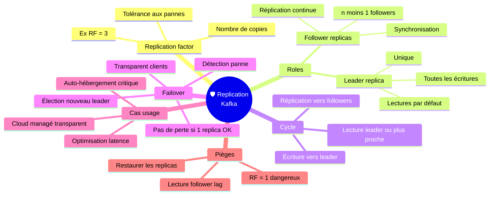

# Apache Kafka — Replication

## Table des matières
- [Module 1 : Replication dans Apache Kafka](#module-1--replication-dans-apache-kafka)

---

## Module 1 : Replication dans Apache Kafka

### Sujet

Ce module introduit le mécanisme de **replication** dans Apache Kafka : pourquoi il est indispensable, comment il fonctionne, et ce qu'il apporte en termes de fiabilité et de tolérance aux pannes.

---

### Concepts clés

**Replication Factor**
Le *replication factor* est un paramètre de configuration qui définit le nombre de copies de chaque partition. Avec un *replication factor* de 3, chaque partition est dupliquée sur 3 brokers différents. Ce paramètre est critique : il détermine directement le niveau de tolérance aux pannes du cluster.

##### Schéma — Replication factor = 3 (1 partition dupliquée 3 fois)

---

**Leader Replica**
Chaque partition possède une *leader replica* (réplica leader). C'est sur ce leader que toutes les écritures et, par défaut, toutes les lectures sont effectuées. Il n'y a toujours qu'un seul leader par partition à un instant donné.

##### Schéma — Le leader, point d'entrée unique des écritures

---

**Follower Replicas**
Les *follower replicas* sont les copies passives de la partition. Pour un *replication factor* de `n`, il y a `n - 1` followers. Leur rôle est de répliquer en continu les messages écrits dans le leader, aussi vite que possible, afin de rester synchronisés.

##### Schéma — Leader & followers (replication factor = n)

---

### Fonctionnement

1. **Écriture** : Toute écriture de données passe obligatoirement par le leader de la partition concernée, sans exception.
2. **Réplication** : Les followers surveillent le leader en permanence et *scraping* (récupèrent) les nouveaux messages au fur et à mesure qu'ils arrivent, dans le but de maintenir une copie à jour.
3. **Lecture** : Par défaut, les lectures se font également sur le leader. Depuis les versions récentes de Kafka, il est possible de configurer le client pour qu'il lise depuis le *replica* le plus proche géographiquement ou réseau, y compris un follower, afin de réduire la latence.

##### Schéma — Cycle écriture / réplication / lecture

---

##### Schéma — Lecture depuis le replica le plus proche (option latence)

---

### Tolérance aux pannes

En cas de défaillance d'un broker :
- Les partitions dont le leader résidait sur ce broker deviennent indisponibles temporairement.
- Le cluster **élit automatiquement un nouveau leader** parmi les followers encore disponibles pour chacune de ces partitions.
- Les données ne sont pas perdues tant qu'au moins un *replica* est intact.
- Une fois le broker défaillant restauré (ou remplacé), le cluster peut reconstituer les replicas manquants pour revenir au *replication factor* cible.

**Important** : la réélection du leader est automatique et transparente pour les applications clientes — le cluster reste disponible et les données restent accessibles.

##### Schéma — Failover automatique d'un leader

---

### Cas d'usage

- **Fiabilité en auto-hébergement** : si vous gérez vous-même les serveurs Kafka (bare metal ou instances cloud), la réplication est un point absolument critique à configurer et surveiller.
- **Services cloud managés** : si vous utilisez un service Kafka cloud (ex. Confluent Cloud, Amazon MSK), la réplication est gérée automatiquement en arrière-plan — vous n'avez pas à vous en préoccuper opérationnellement.
- **Optimisation de performance** : dans les environnements où la latence réseau est un enjeu, il est possible de configurer les clients lecteurs pour consommer depuis le *replica* le plus proche, au lieu du leader, afin de gagner en rapidité.

##### Schéma — Trois cas d'usage de la replication

---

### Mises en garde

- Stocker une partition sur un seul broker est insuffisant : les disques et serveurs peuvent tomber en panne à tout moment.
- Après une défaillance, même si le cluster élit un nouveau leader automatiquement, il reste nécessaire de **restaurer le nombre de replicas** pour retrouver le niveau de résilience souhaité.
- Lire depuis un follower (plutôt que le leader) peut introduire un léger décalage si le follower n'est pas complètement synchronisé. Cette option est à réserver aux cas où la performance prime sur la cohérence stricte.

##### Schéma — Pièges à éviter

---

### Points à retenir

- La **replication** est un mécanisme fondamental de la fiabilité de Kafka.
- Elle assure **fault tolerance** (tolérance aux pannes), **load balancing**, et des performances saines à l'échelle du cluster.
- Les **écritures** vont toujours vers le **leader**.
- Les **lectures** vont par défaut vers le **leader**, mais peuvent être dirigées vers le **replica le plus proche** pour optimiser la latence.
- En cas de panne, Kafka élit automatiquement un nouveau leader — **aucune perte de données** tant qu'un replica est disponible.
- C'est une fonctionnalité **entièrement intégrée** à Kafka, sans dépendance externe.

##### Schéma de synthèse — Carte mentale du module Replication

