# Apache Kafka — Introduction aux Producers

## Table des matières
- [Module 1 : Les Producers Kafka](#module-1--les-producers-kafka)

---

## Module 1 : Les Producers Kafka

### Sujet

Ce module introduit le concept de **producer** dans Apache Kafka : ce qu'est un producer, comment il s'intègre dans l'écosystème Kafka, et comment il s'utilise concrètement via l'API Java.

---

### Concepts clés

#### Producer
Un **producer** est une application cliente qui écrit des données dans un cluster Kafka. Tout composant de la plateforme Kafka qui n'est pas un broker est, au fond, soit un producer, soit un consumer, soit les deux. Les producers sont le mécanisme par lequel on insère des données dans Kafka.

##### Schéma — Producer / Consumer / Broker dans l'écosystème

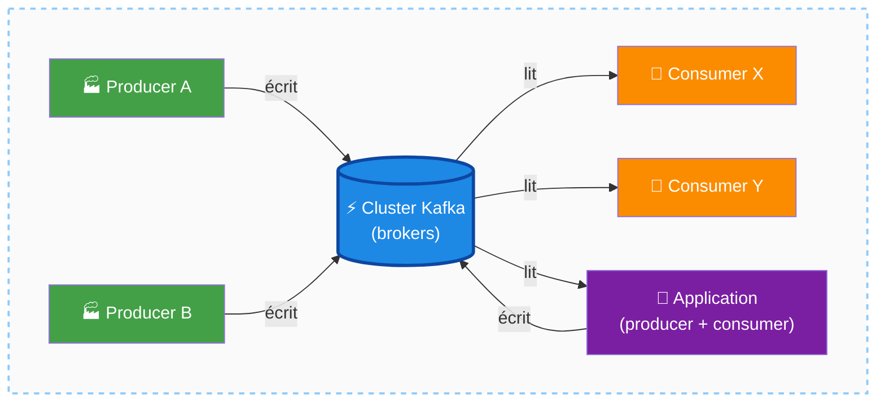

---

#### KafkaProducer
`KafkaProducer` est la classe principale de l'API Java permettant à une application de se connecter au cluster et d'y envoyer des messages. Elle gère en interne toute la plomberie réseau : connexion aux brokers, accusés de réception (acknowledgements), retransmissions en cas d'échec, idempotence forcée, batching pour optimiser le débit, etc.

##### Schéma — KafkaProducer : façade simple, plomberie complexe

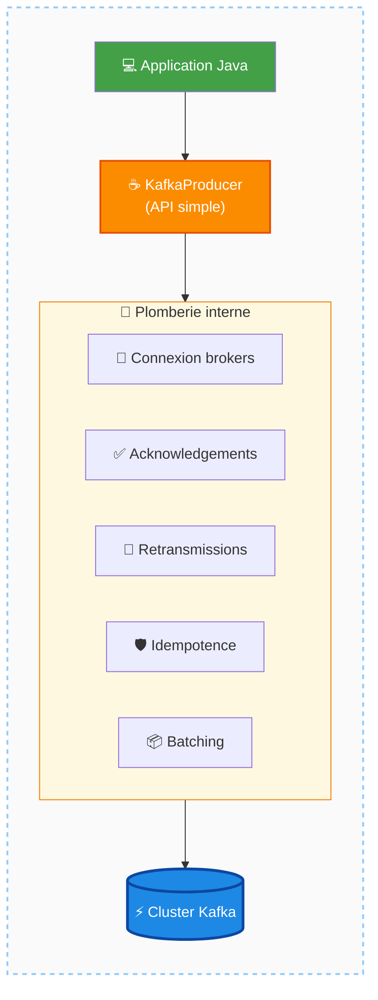

---

#### ProducerRecord
`ProducerRecord` est la classe utilisée pour représenter un message à envoyer. Un message Kafka est une **paire clé-valeur**. Le `ProducerRecord` encapsule :
- la **clé** du message
- la **valeur** du message
- le **topic** de destination
- optionnellement : le **timestamp**, la **partition** cible, et des **headers** (paires clé-valeur supplémentaires)

##### Schéma — Anatomie d'un ProducerRecord

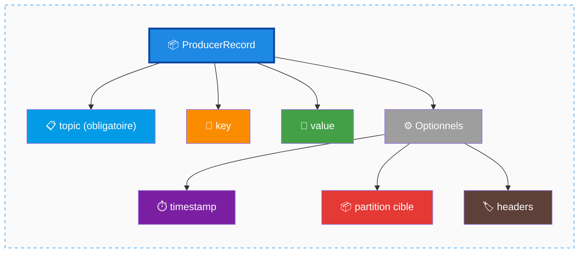

---

#### Bootstrap Servers
Le paramètre `bootstrap.servers` est une liste de quelques brokers du cluster (deux ou trois suffisent). Il permet au producer de se connecter à au moins un broker pour récupérer les métadonnées complètes du cluster. Il est inutile — et déconseillé — de lister tous les brokers, car leur nombre peut être élevé (ex. 50) et certains peuvent être temporairement indisponibles.

##### Schéma — Bootstrap : un point d'entrée, puis découverte complète

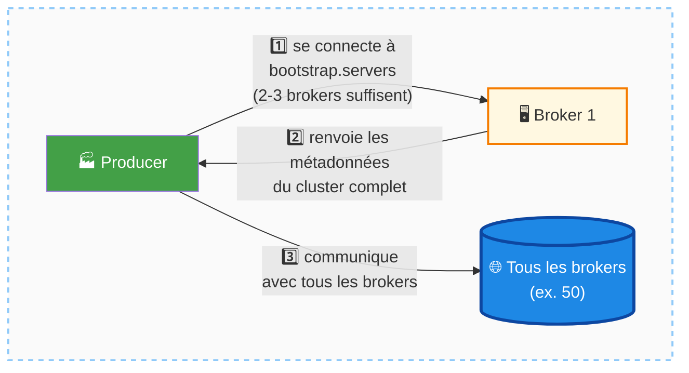

---

#### Sérialisation
Kafka est agnostique au format de données : la clé et la valeur sont de simples **bytes**. Des sérialiseurs natifs existent pour les types primitifs (`Integer`, `Long`, `Double`, `String`). Pour des objets métier complexes, il est recommandé d'utiliser un format structuré (ex. Avro, Protobuf) avec le **Confluent Schema Registry**, abordé dans un module ultérieur du cours.

##### Schéma — Sérialisation : objet → bytes

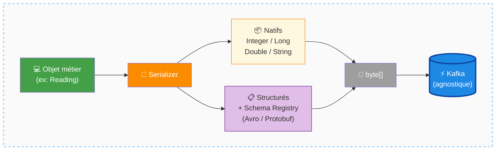

---

### Fonctionnement

#### Configuration du producer
Le `KafkaProducer` reçoit un ensemble de **paramètres de configuration** sous forme de paires clé-valeur (souvent via un fichier `properties`). Les paramètres fondamentaux sont :
- `bootstrap.servers` : liste des adresses de brokers pour l'initialisation de la connexion.
- `acks` : niveau d'accusé de réception souhaité (ex. `acks=all` pour une durabilité maximale).

En pratique, une configuration réelle comporte généralement entre 5 et 10 paramètres (sécurité, compression, timeouts, etc.).

##### Schéma — Configuration via paires clé-valeur

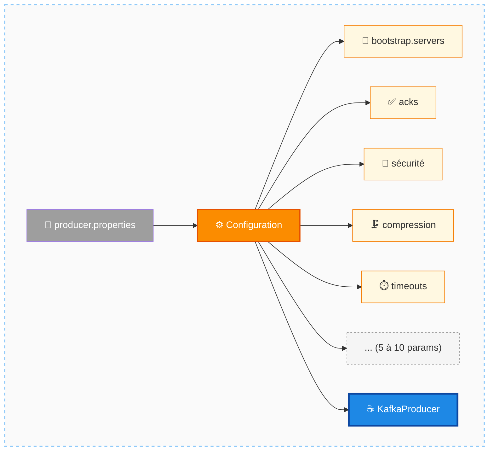

---

#### Envoi d'un message
1. Créer un objet `KafkaProducer` avec la configuration appropriée.
2. Créer un `ProducerRecord` contenant le topic, la clé et la valeur du message.
3. Appeler la méthode d'envoi du producer.

Sous le capot, le producer gère automatiquement les connexions, les retransmissions, et les accusés de réception.

##### Schéma — Envoi d'un message en 3 étapes

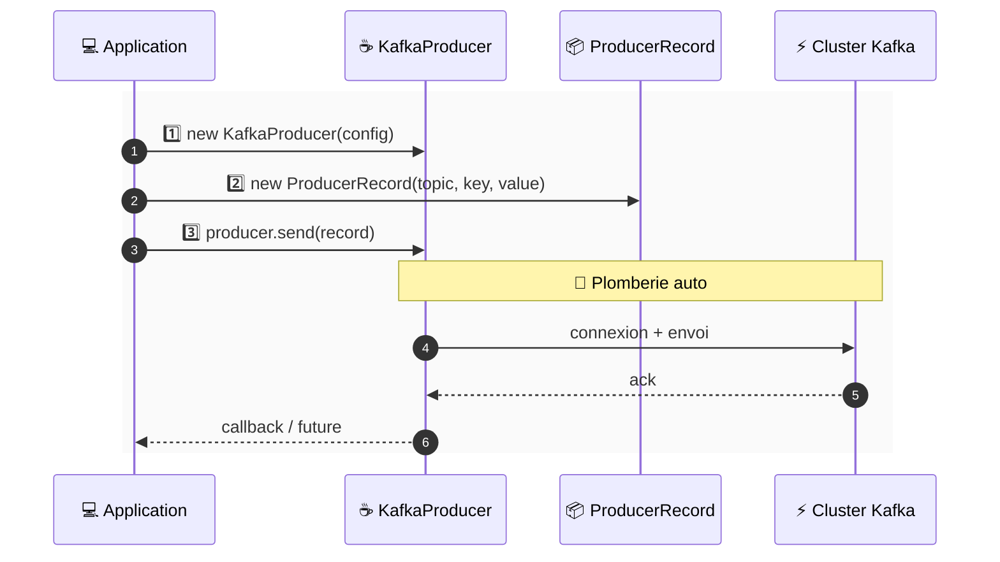

---

#### Sélection de la partition
C'est la **bibliothèque producer** qui détermine dans quelle partition écrire chaque message. Elle le fait par **hachage de la clé** (si une clé est fournie) ou par **round-robin** (si aucune clé n'est définie). Le développeur peut aussi forcer une partition spécifique via le `ProducerRecord`.

##### Schéma — 3 stratégies de routage vers la partition

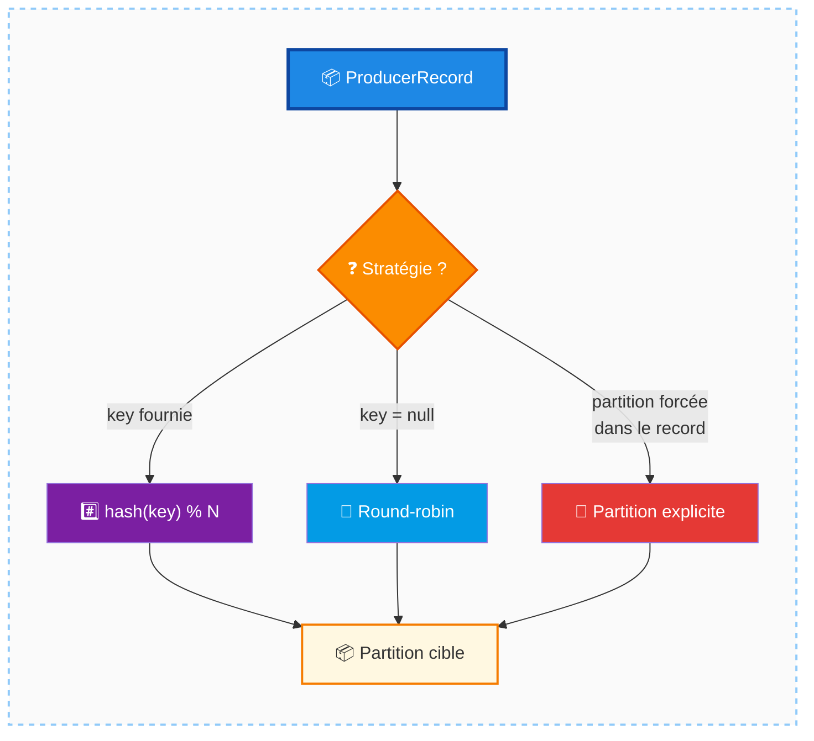

---

### Cas d'usage

- Une application de **thermostat connecté** qui publie régulièrement des relevés de température dans un topic Kafka.
- Tout service applicatif qui doit **injecter des événements** dans un pipeline de données en temps réel.

##### Schéma — Exemple : thermostat connecté → Kafka

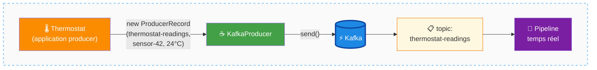

---

### Comparaisons

| Langue / Plateforme          | Support                                      |
|------------------------------|----------------------------------------------|
| Java                         | Natif (officiel, fonctionnalités en premier) |
| Python, Go, JavaScript, .NET | Support officiel Confluent                   |
| Autres langages              | Drivers communautaires disponibles           |

##### Schéma — Support multi-langage

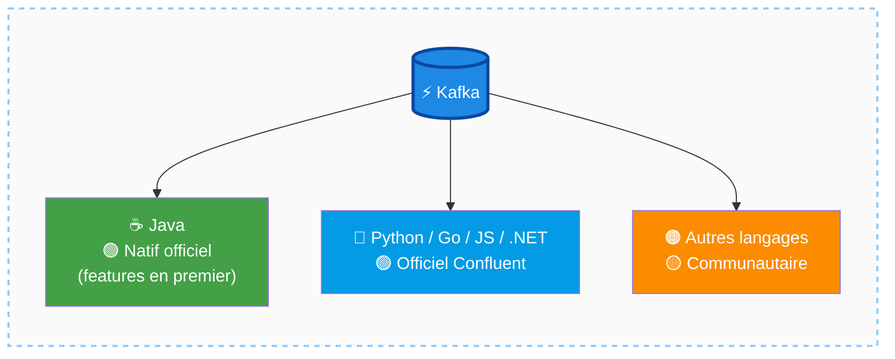

---

### Mises en garde

- **Sérialisation simpliste** : convertir un objet en JSON sous forme de `String` est fonctionnel mais peu robuste. Il vaut mieux utiliser un sérialiseur adapté au schéma réel de l'objet, notamment via le Schema Registry.
- **Ne pas lister tous les brokers** dans `bootstrap.servers` : quelques adresses suffisent pour établir la connexion initiale et récupérer les métadonnées complètes.
- **L'API semble simple, mais ne l'est pas** : le `KafkaProducer` effectue de nombreuses opérations complexes en arrière-plan (gestion des erreurs réseau, idempotence, batching). Il est important de comprendre ces mécanismes pour configurer correctement le producer selon les besoins (latence faible vs débit élevé).

##### Schéma — Pièges à éviter

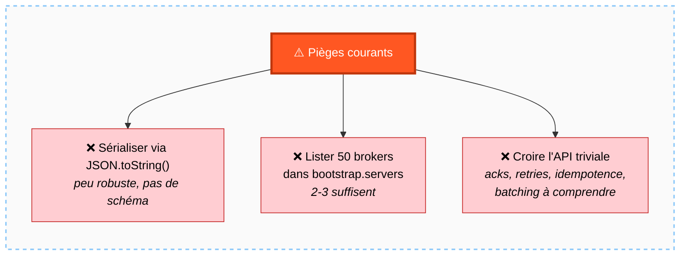

---

### Points à retenir

- Un **producer** est toute application cliente qui écrit dans Kafka.
- L'API principale repose sur deux classes : `KafkaProducer` et `ProducerRecord`.
- La configuration se fait via des paramètres clé-valeur ; `bootstrap.servers` et `acks` sont les plus importants à connaître.
- La clé et la valeur d'un message sont des **bytes** : la sérialisation est à la charge du producer.
- C'est le producer qui décide de la **partition cible**, par hachage de la clé ou round-robin.
- La complexité réelle est masquée par la simplicité de l'API : acknowledgements, retransmissions, idempotence et batching sont gérés automatiquement.

##### Schéma de synthèse — Carte mentale du module Producers

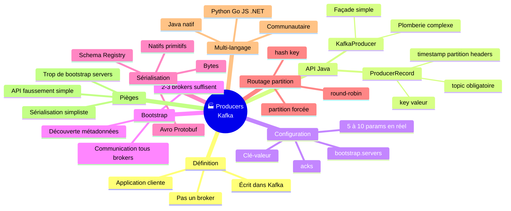

