# Apache Kafka — Consumers

## Table des matières
- [Module 1 : Introduction aux Consumers Kafka](#module-1--introduction-aux-consumers-kafka)
- [Module 2 : Consumer Offset Tracking](#module-2--consumer-offset-tracking)
- [Module 3 : Consumer Groups et scalabilité](#module-3--consumer-groups-et-scalabilité)

---

## Module 1 : Introduction aux Consumers Kafka

### Sujet
Les consumers sont les composants clients situés **en dehors du cluster Kafka**, responsables de la **lecture des messages** depuis les topics Kafka. Ce module présente l'API consumer en Java et explique le fonctionnement de base de la consommation de messages.

##### Schéma — Le consumer dans l'écosystème

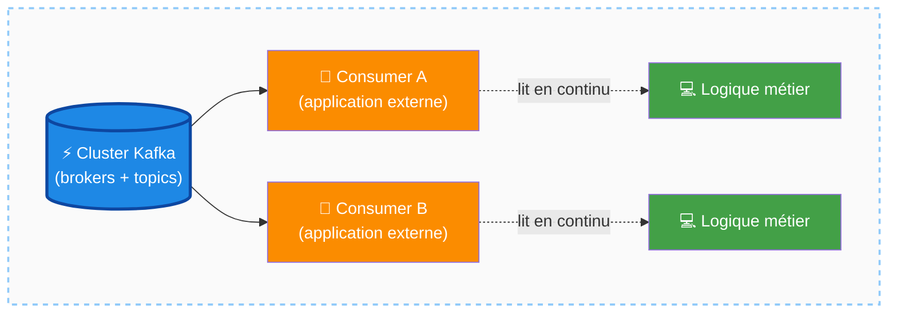

### Concepts clés

- **KafkaConsumer** : classe Java utilisée pour se connecter au cluster Kafka et lire des messages. Elle fonctionne sur le même principe que le `KafkaProducer` : on lui fournit une `Map` de paires clé-valeur (fichier de configuration).
- **bootstrap.servers** : configuration minimale obligatoire. Il n'est pas nécessaire de lister tous les brokers — un seul broker accessible suffit pour que le consumer découvre automatiquement la topologie complète du cluster.
- **subscribe()** : méthode appelée sur le `KafkaConsumer` pour s'abonner à un ou plusieurs topics. Elle prend **obligatoirement une liste** (même pour un seul topic). Elle supporte également une **expression régulière** (RegEx) pour s'abonner à tous les topics dont le nom correspond au pattern.
- **poll()** : méthode appelée en boucle infinie pour interroger le cluster et récupérer les nouveaux messages disponibles. Sous le capot, la librairie identifie les partitions des topics souscrits, localise les brokers leaders de ces partitions, et leur envoie des requêtes réseau.
- **ConsumerRecords<K, V>** : collection générique retournée par `poll()`, contenant les messages reçus. Les types génériques (`String, String` dans l'exemple) doivent correspondre aux types utilisés lors de la production.

##### Schéma — Anatomie de l'API KafkaConsumer

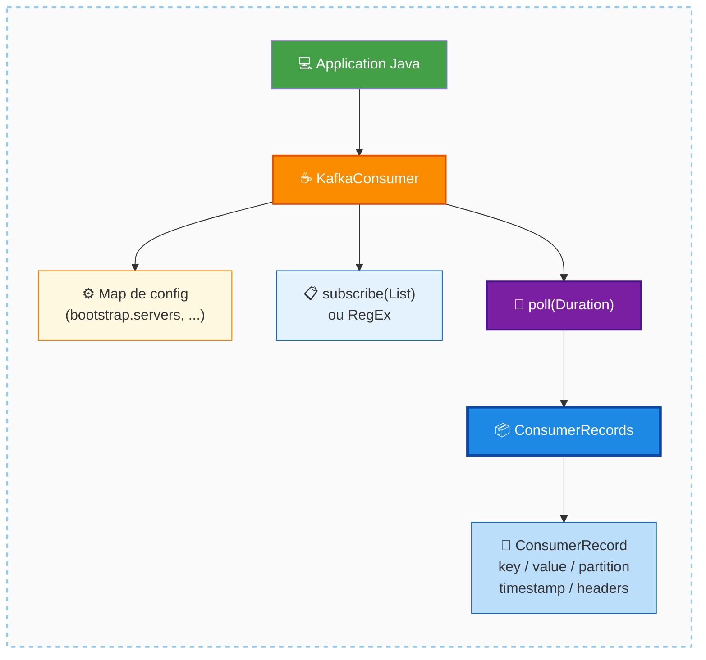

### Fonctionnement

1. Instancier un `KafkaConsumer` avec les propriétés de connexion.
2. Appeler `subscribe(List<String> topics)` pour indiquer quel(s) topic(s) lire.
3. Entrer dans une **boucle infinie** et appeler `poll(Duration)` à chaque itération.
4. Itérer sur la collection `ConsumerRecords` reçue et traiter chaque `ConsumerRecord`.
5. Chaque enregistrement expose notamment : **key**, **value**, partition d'origine, timestamp, headers.

##### Schéma — La poll loop : cycle de vie d'un consumer

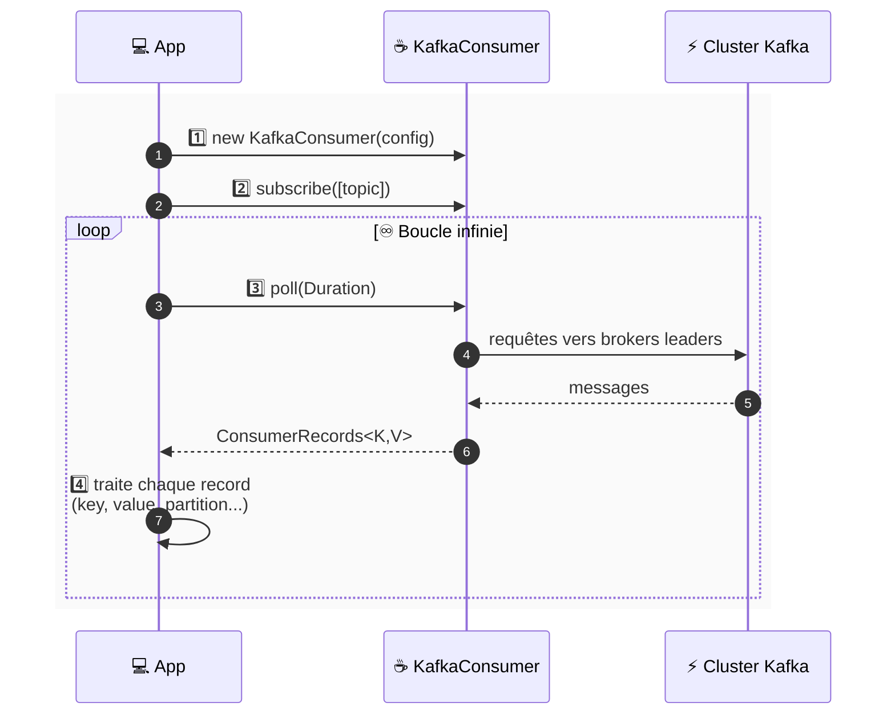

### Cas d'usage
- Applications de streaming où les messages arrivent en continu et doivent être traités en temps réel.
- La boucle infinie est le paradigme normal : contrairement au traitement par lots, le streaming n'a pas de "dernier message". Il y a toujours potentiellement de nouveaux messages à lire.

##### Schéma — Streaming continu vs traitement par lots

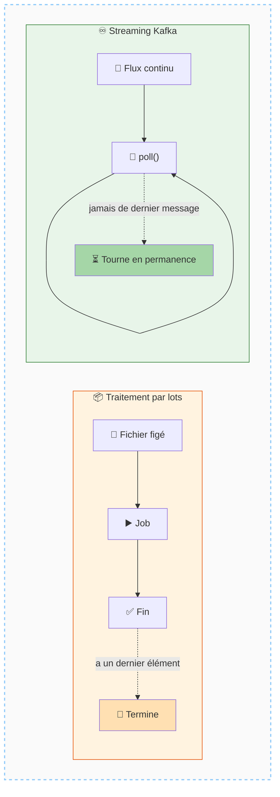

### Comparaisons

| Aspect                    | Kafka Consumer                        | Queue traditionnelle                           |
|---------------------------|---------------------------------------|------------------------------------------------|
| Persistance après lecture | Le message **reste** dans le topic    | Le message est **supprimé** après consommation |
| Nombre de lecteurs        | **Illimité** (consumers indépendants) | Généralement un seul consommateur par message  |

##### Schéma — Consumer Kafka vs Queue traditionnelle

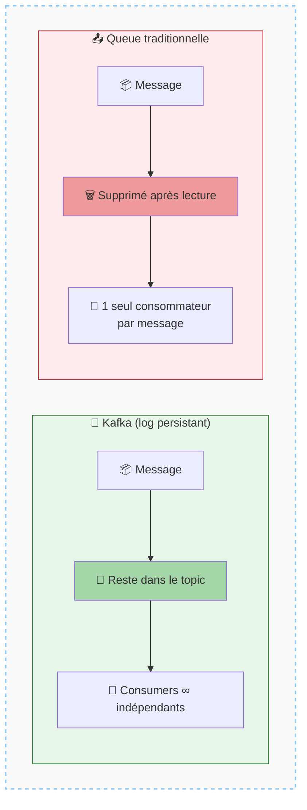

### Mises en garde
- Les types génériques du `KafkaConsumer<K, V>` doivent **correspondre** à ceux utilisés par le producer. Une incohérence de types entraîne des erreurs de désérialisation.
- La valeur d'un message est souvent un **objet métier** (domain object) avec un schéma structuré — cela sera couvert plus en détail dans les modules sur les schémas.

### Points à retenir
- Kafka est un **log**, pas une queue : consommer un message ne le supprime pas.
- Plusieurs consumers **indépendants** peuvent lire les mêmes messages simultanément.
- La méthode `poll()` est le cœur de tout consumer Kafka.

---

## Module 2 : Consumer Offset Tracking

### Sujet
Ce module explique comment Kafka gère la **position de lecture** de chaque consumer via le mécanisme des **offsets**, permettant à un consumer de reprendre là où il s'était arrêté en cas de panne ou de redémarrage.

##### Schéma — Position de lecture dans une partition

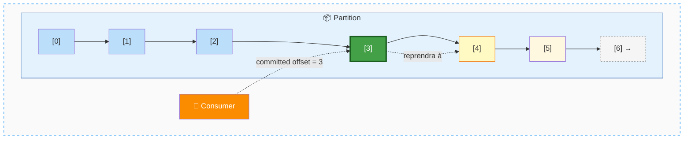

### Concepts clés

- **Offset** : identifiant numérique unique attribué à chaque message dans une partition. Il représente la position du message dans le log de la partition.
- **Consumer Offset Commit** : action par laquelle un consumer **signale au cluster** l'offset du dernier message qu'il a correctement traité. Cela permet au cluster de mémoriser la progression du consumer.
- **Internal Topic (`__consumer_offsets`)** : topic interne spécial dans lequel Kafka stocke les offsets commités par les consumers. Kafka utilise ainsi ses propres mécanismes pour implémenter cette fonctionnalité.

##### Schéma — Stockage des offsets dans `__consumer_offsets`

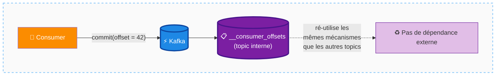

### Fonctionnement

1. Le consumer lit les messages (offset 1, 2, 3…).
2. Après traitement réussi d'un message, il **commite l'offset** correspondant vers le cluster.
3. Si le traitement d'un message échoue (ex. : offset 3), l'offset n'est **pas commité**.
4. Lors du redémarrage du consumer, il reprend à partir du dernier offset commité, et retente le traitement du message raté.

**Optimisation des commits** : les commits ne se font pas nécessairement message par message (ce serait coûteux en performances). Ils sont généralement **regroupés par batch**, déclenchés selon :
- Un seuil de nombre de messages traités, ou
- Un intervalle de temps configuré.

Ces paramètres sont documentés et configurables selon les besoins de performance.

##### Schéma — Échec de traitement et reprise au redémarrage

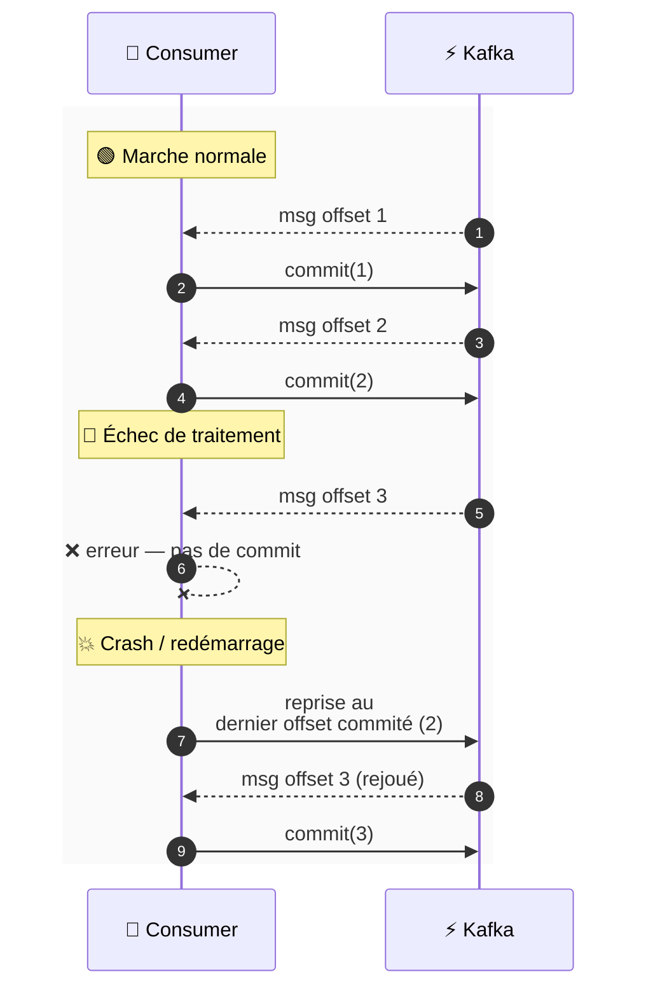

##### Schéma — Commits batchés par seuil ou par temps

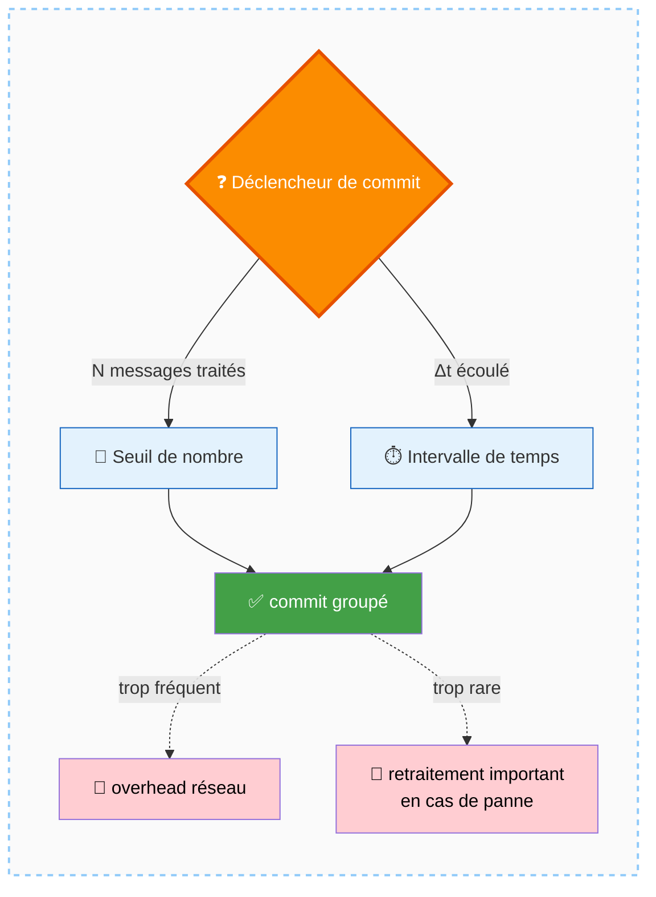

### Mises en garde
- Si un consumer traite un message mais **ne commite pas** l'offset (ex. : crash avant le commit), il retraitera ce message au prochain démarrage. Il faut donc concevoir les consumers pour être **idempotents** si possible.
- La granularité des commits est un paramètre d'optimisation : trop fréquent = overhead réseau ; pas assez fréquent = risque de retraitement important en cas de panne.

### Points à retenir
- Les offsets permettent à Kafka de savoir **exactement où** chaque consumer en est dans sa lecture.
- Le commit d'offset est une **confirmation de traitement réussi**, pas simplement une confirmation de réception.
- Kafka stocke ces offsets dans son propre topic interne — pas de dépendance externe nécessaire.

---

## Module 3 : Consumer Groups et scalabilité

### Sujet
Ce module introduit le concept de **consumer groups**, qui permet à plusieurs consumers de collaborer pour lire un même topic de manière scalable et parallèle.

##### Schéma — Consumer Group : coopération par répartition des partitions

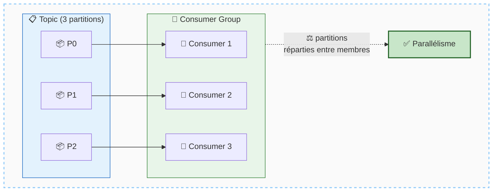

### Concepts clés

- **Consumer Group** : ensemble de consumers qui coopèrent pour lire un topic. Chaque consumer du groupe est **mono-threadé** : il ne traite qu'un message à la fois, issu d'une seule partition à la fois.
- **Consumer indépendant** : un consumer peut aussi opérer de manière totalement indépendante d'un autre consumer, chacun lisant l'intégralité du topic à son propre rythme (ex. : Consumer A et Consumer B lisent les mêmes messages indépendamment).

##### Schéma — Consumer Group vs Consumers indépendants

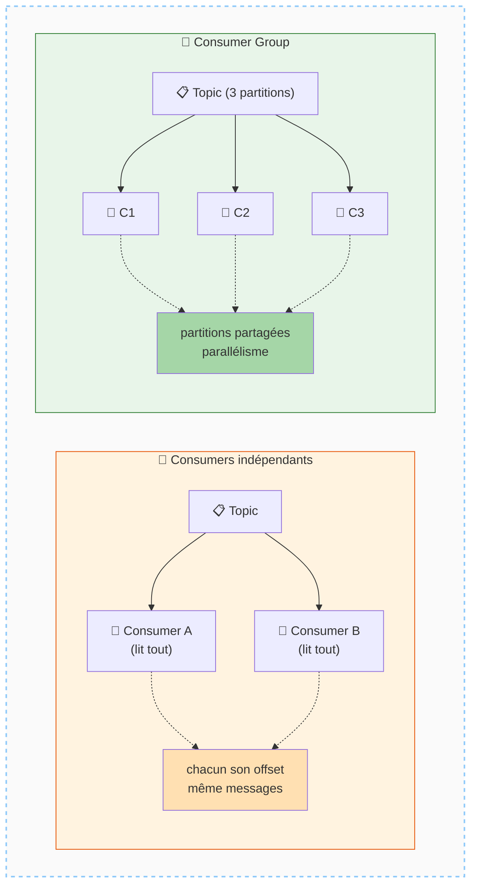

### Fonctionnement

- Un topic à 3 partitions peut être lu par un seul consumer (Consumer A), qui reçoit alors des messages provenant de **n'importe laquelle** des 3 partitions.
- Ajouter un Consumer B **n'interfère pas** avec Consumer A : ils lisent de façon indépendante, chacun gérant son propre offset.
- Les consumers d'un même **consumer group** se **répartissent les partitions** entre eux, permettant un traitement parallèle.

##### Schéma — 3 scénarios de consommation

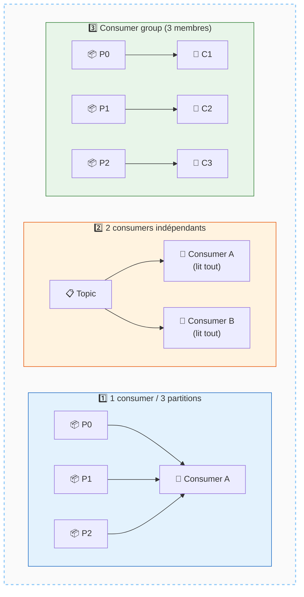

### Comparaisons

| Configuration                        | Comportement                                                             |
|--------------------------------------|--------------------------------------------------------------------------|
| 1 consumer, 3 partitions             | Le consumer lit depuis les 3 partitions séquentiellement                 |
| 2 consumers indépendants             | Chacun lit toutes les partitions indépendamment (duplication de lecture) |
| Consumer group (plusieurs consumers) | Les partitions sont réparties entre les membres du groupe (parallélisme) |

### Mises en garde
- Les consumers sont **mono-threadés** par nature. Pour augmenter le débit de traitement, il faut augmenter le nombre de consumers (et idéalement le nombre de partitions du topic).

##### Schéma — Limite : un consumer par partition au maximum dans un groupe

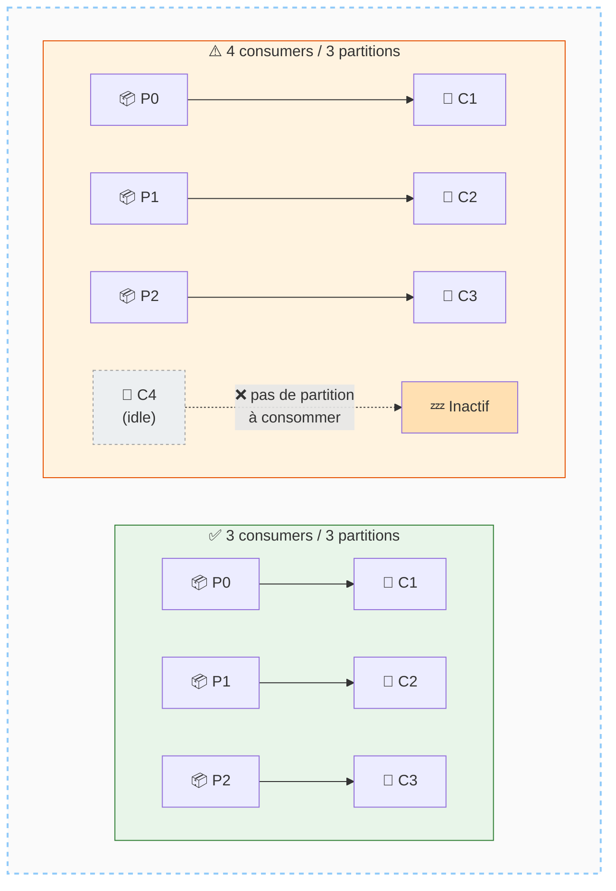

### Points à retenir
- Les consumer groups sont le mécanisme principal de **scalabilité horizontale** côté lecture dans Kafka.
- Kafka n'est **pas une queue** : plusieurs consumers (ou groupes) peuvent lire les mêmes messages sans interférence.
- La scalabilité d'un consumer group est naturellement **bornée par le nombre de partitions** du topic (un consumer par partition au maximum dans un groupe).

---

##### Schéma de synthèse — Carte mentale Consumers (3 modules)

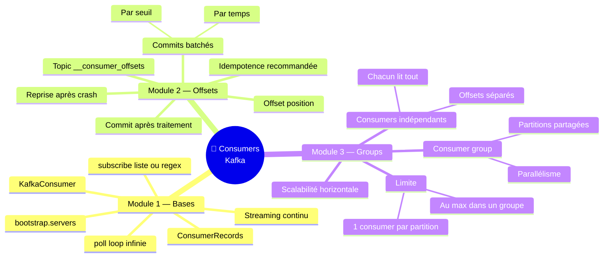

