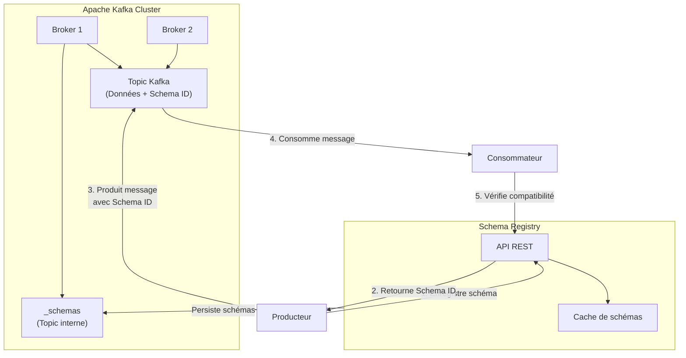
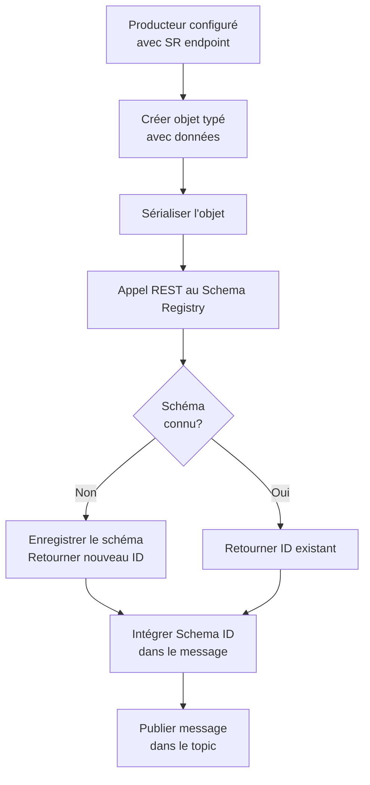
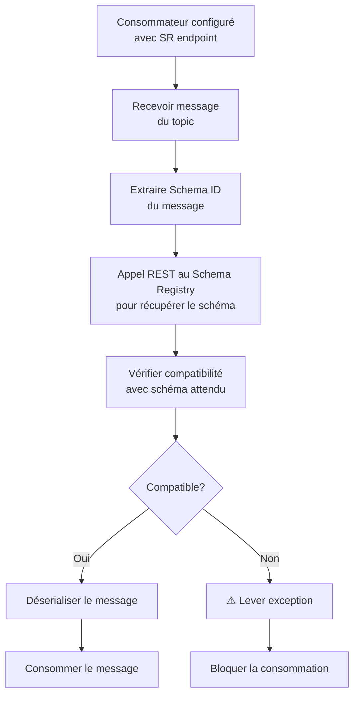
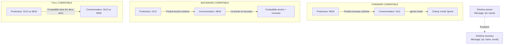
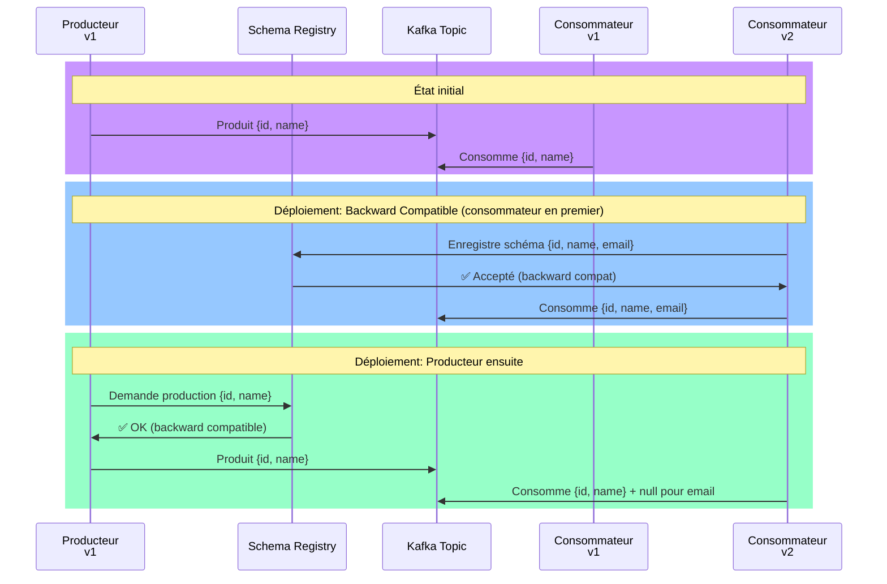
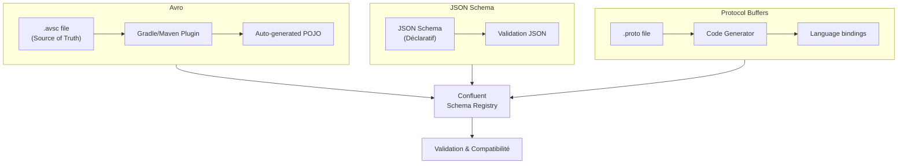
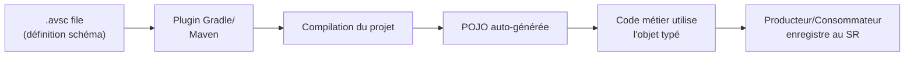
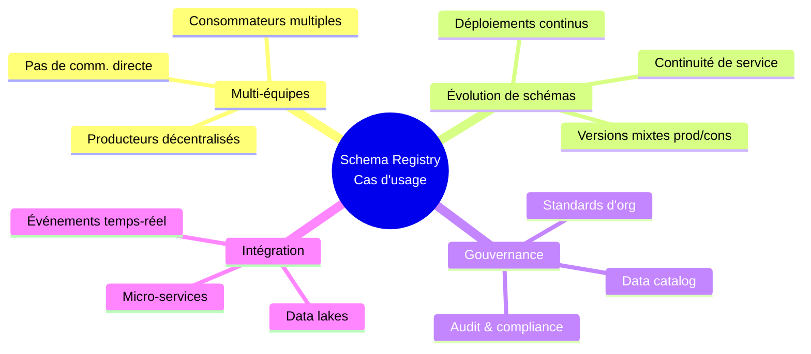
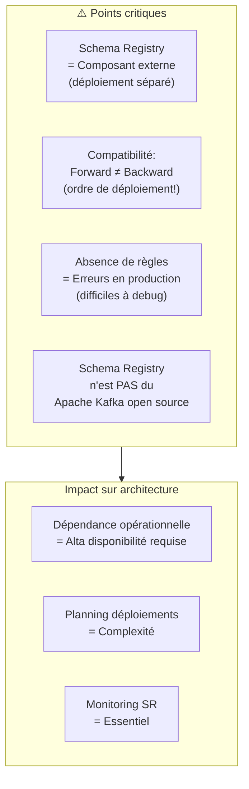
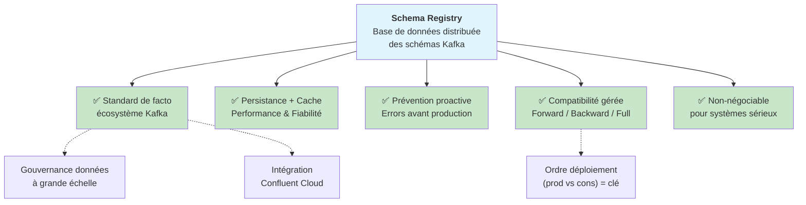

# Confluent Schema Registry — Apache Kafka

## Table des matières
- [Module 1 : Confluent Schema Registry](#module-1--confluent-schema-registry)

---

## Module 1 : Confluent Schema Registry

### Sujet

Ce module introduit le **Confluent Schema Registry**, un composant essentiel dans un écosystème Apache Kafka, conçu pour gérer les schémas des messages échangés entre producteurs et consommateurs et pour garantir la compatibilité lors des évolutions de ces schémas.

---

### Concepts clés

#### Problèmes adressés par le Schema Registry

Deux problèmes majeurs émergent naturellement dans tout système Kafka non trivial :

1. **L'émergence de nouveaux consommateurs** : À mesure qu'un topic contient des données utiles, de nouvelles applications (développées par la même équipe ou par des équipes tierces) voudront consommer ces messages. Ces nouveaux consommateurs ont besoin de comprendre le format des messages présents dans le topic.

2. **L'évolution des schémas** : Les modèles de données changent avec le temps. Plusieurs questions se posent alors : les consommateurs existants seront-ils capables de traiter des messages dans un nouveau format ? Que se passe-t-il quand des producteurs en différentes versions (ancienne et nouvelle) cohabitent ? Comment gérer ces transitions sans casser le système ?

#### Qu'est-ce que le Schema Registry ?

Le **Schema Registry** est un serveur autonome (processus standalone) qui s'exécute en dehors des brokers Kafka. Il ne fait **pas partie d'Apache Kafka open source** : c'est un composant à licence communautaire développé par Confluent, mais largement adopté et standardisé dans l'écosystème Kafka.

Du point de vue du cluster Kafka, le Schema Registry est simplement une application cliente comme une autre (producteur/consommateur). Son rôle est de maintenir **une base de données de tous les schémas** utilisés pour produire des messages dans le cluster.

- Cette base de données est **persistée dans un topic Kafka interne** dédié.
- Elle est **mise en cache** dans le Schema Registry pour un accès à faible latence, minimisant les allers-retours réseau.
- Il peut être déployé en **configuration haute disponibilité** (plusieurs instances redondantes).

---

### Architecture générale

---

### Fonctionnement

#### Côté Producteur

1. Le producteur est configuré avec l'adresse réseau du Schema Registry (via sa `properties map`).
2. Lors de la production d'un message, le producteur sérialise un objet typé (pas une simple chaîne de caractères) qui contient un **schema ID** interne.
3. Le producteur contacte le Schema Registry via son **API REST** pour signaler ce nouveau schéma :
    - Si le schéma est **inconnu** : le Schema Registry l'enregistre et retourne un ID.
    - Si le schéma est **déjà connu** : le Schema Registry confirme et renvoie l'ID correspondant.
4. Le producteur **intègre le schema ID dans le message** avant de le publier dans le topic.

#### Côté Consommateur

1. Le consommateur connaît également l'objet typé associé au schéma (et donc son schema ID attendu).
2. Lors de la consommation d'un message, il interroge le Schema Registry pour vérifier si le schéma du message reçu est **compatible** avec celui qu'il attend.
3. Selon le résultat, il consomme le message ou lève une exception.

---

### Compatibilité des schémas

Le topic peut être configuré avec une **règle de compatibilité** qui détermine comment les évolutions de schéma sont gérées :

#### Modes de compatibilité

| Mode                           | Description                                                                                                                                                                                                |
|--------------------------------|------------------------------------------------------------------------------------------------------------------------------------------------------------------------------------------------------------|
| **Forward compatible**         | Les nouveaux producteurs peuvent produire des messages que les anciens consommateurs sont capables de lire. À utiliser quand on déploie les producteurs en premier.                                        |
| **Backward compatible**        | Les nouveaux consommateurs peuvent lire des messages produits avec d'anciens schémas. À utiliser quand on déploie les consommateurs en premier, ou quand on ne maîtrise pas tous les producteurs en amont. |
| **Full compatible** (les deux) | Compatible dans les deux sens.                                                                                                                                                                             |
| **None**                       | Aucune vérification de compatibilité (peu recommandé).                                                                                                                                                     |

| Changement                               | Backward      | Forward    | Explication simple                             |
|------------------------------------------|---------------|------------|------------------------------------------------|
| ➕ Add field **sans default**            | ❌            | ✅         | Les anciens ignorent, les nouveaux cassent     |
| ➕ Add field **avec default**            | ✅            | ✅         | Default comble les anciennes données           |
| ➖ Remove field                          | ✅            | ❌         | Les nouveaux ignorent, les anciens cassent     |
| 🔁 Rename field                          | ❌            | ❌         | Vu comme remove + add → casse tout             |
| 🔄 Change type (compatible)              | ⚠️            | ⚠️         | Dépend (ex: int → long OK)                     |
| 🔄 Change type (incompatible)            | ❌            | ❌         | Ex: string → int                               |
| 🔒 Add required field (no default)       | ❌            | ✅         | Même logique que add sans default              |
| 🔓 Make field optional                   | ✅            | ✅         | Plus flexible                                  |
| 🔐 Make optional → required              | ❌            | ❌         | Peut casser des données existantes             |
#### Scenario de déploiement

**Comportement en cas d'incompatibilité** : le Schema Registry provoque une **exception prévisible** côté producteur ou consommateur avant qu'une opération incompatible ne soit exécutée. Cela évite des erreurs imprévisibles en production.

---

### Formats de sérialisation supportés

Le Confluent Schema Registry supporte trois formats de sérialisation :

- **JSON Schema** : Format déclaratif simple, basé sur JSON
- **Avro** : Format compact avec système de types riche
- **Protobuf** : Format binaire compact, multilangage

#### Focus sur Avro

Avro dispose d'un **IDL (Interface Description Language)** sous forme de fichier `.avsc`. Des outils (plugins Gradle ou Maven pour Java) permettent de **générer automatiquement** la classe Java correspondante (POJO) à partir de ce fichier.

**Avantages de cette approche :**
- Le fichier `.avsc` devient la **source de vérité** partagée entre équipes pour négocier les évolutions de schéma (via pull requests, discussions, etc.).
- La **génération de code est automatique** à la compilation.
- Des **vérifications à la compilation** (*compile-time checks*) sont possibles : avant de déployer, on peut interroger le Schema Registry pour savoir si une nouvelle version de schéma est compatible avec les règles définies sur le topic — sans avoir à déployer pour le découvrir.

---

### Cas d'usage

- Systèmes avec **plusieurs équipes productrices et consommatrices** qui n'ont pas toujours une communication directe.
- Systèmes où les **schémas évoluent fréquemment** et où il faut garantir la continuité du service.
- Organisations ayant besoin d'un **standard de gouvernance des données** autour des topics Kafka.

---

### Mises en garde

- Le Schema Registry est **externe aux brokers Kafka** : il doit être déployé et maintenu séparément.
- Sans règle de compatibilité bien définie, les évolutions de schéma peuvent provoquer des erreurs difficiles à diagnostiquer en production.
- Il ne faut pas confondre la compatibilité *forward* et *backward* : le choix dépend de **quel côté (producteur ou consommateur) on déploie en premier** lors d'une montée de version.

---

### Points à retenir

- Le Schema Registry **n'est pas une partie d'Apache Kafka open source**, mais est devenu un standard de facto dans l'écosystème Confluent/Kafka.
- Il agit comme une **base de données de schémas** persistée dans un topic Kafka interne et mise en cache pour la performance.
- Il permet de **bloquer proactivement** les opérations de production ou consommation qui casseraient la compatibilité, évitant ainsi des erreurs imprévisibles.
- Le **choix du mode de compatibilité** (forward, backward, full) doit être pensé en fonction de l'ordre de déploiement des nouvelles versions de producteurs et consommateurs.
- Pour tout système Kafka **non trivial**, l'utilisation du Schema Registry est considérée comme **non négociable** par les experts du domaine.
- Confluent Cloud propose des fonctionnalités complémentaires au-dessus du Schema Registry pour la **gouvernance des données à grande échelle** (catalogues, gestion du changement dans de grandes organisations).