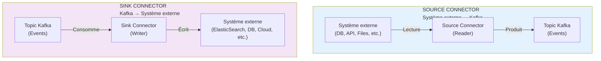
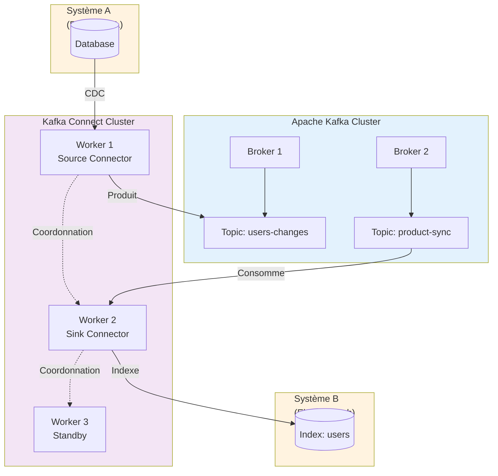
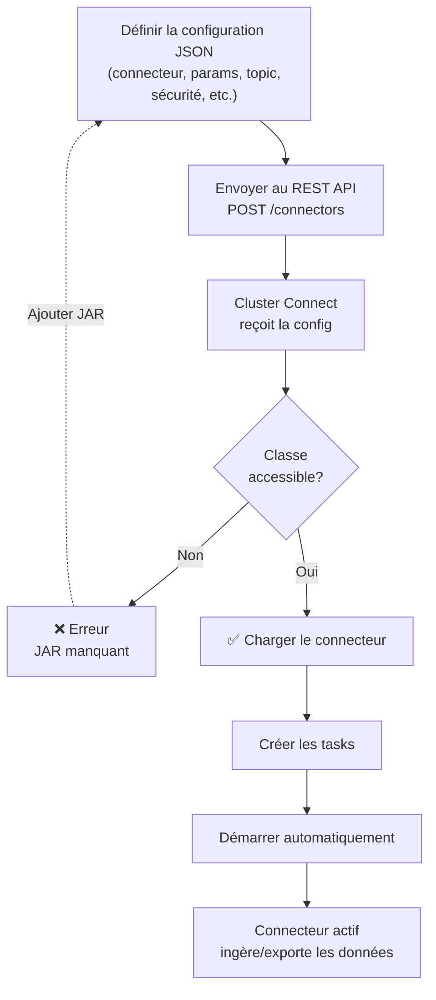
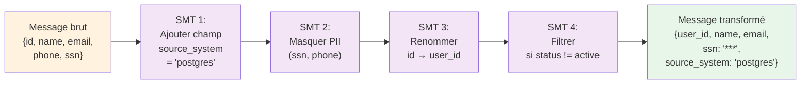
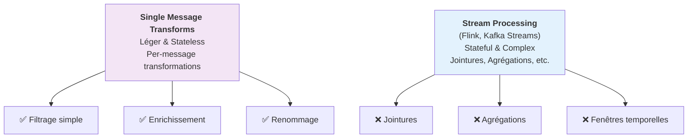
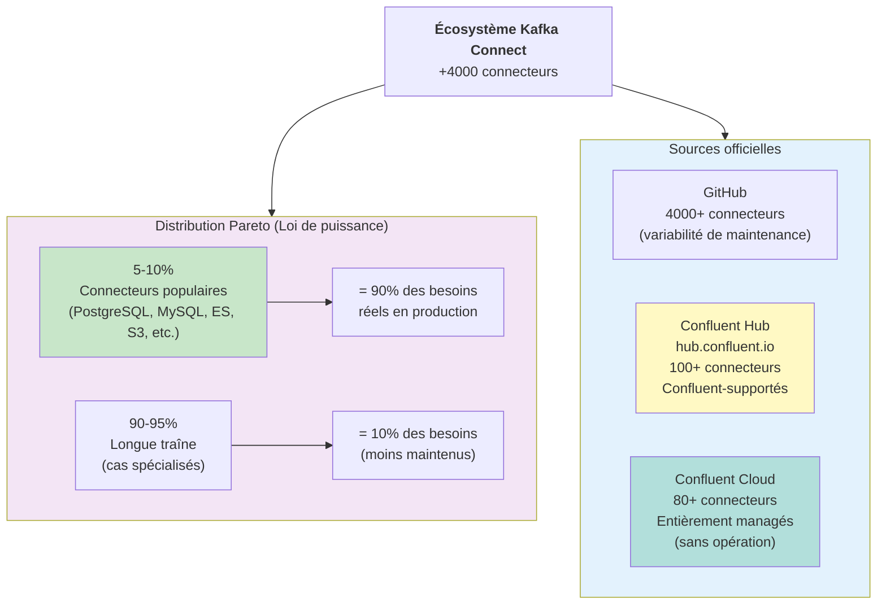
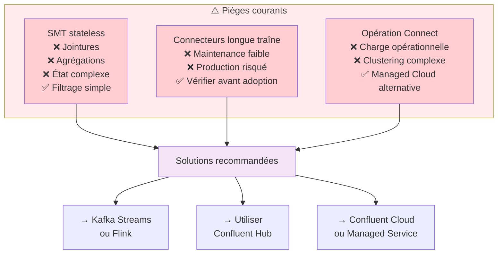
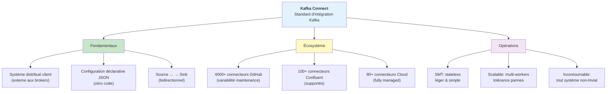

# Kafka Connect — Apache Kafka

## Table des matières
- [Module 1 : Kafka Connect](#module-1--kafka-connect)

---

## Module 1 : Kafka Connect

### Sujet

Ce module introduit **Kafka Connect**, le sous-système d'intégration d'Apache Kafka, conçu pour connecter Kafka à des systèmes externes (bases de données relationnelles, applications SaaS, moteurs de recherche, etc.) de manière standardisée, déclarative et scalable.

---

### Concepts clés

#### Pourquoi Kafka Connect ?

Dans la réalité des systèmes d'information, de nombreux systèmes ne sont pas Kafka. Il est pourtant nécessaire de :
- **Ingérer des données** depuis ces systèmes externes vers des topics Kafka.
- **Exporter des données** depuis des topics Kafka vers ces systèmes externes.

Kafka Connect est l'**API d'intégration officielle de Kafka** pour répondre à ce besoin. C'est à la fois :
- Un **écosystème de connecteurs enfichables** (*pluggable connectors*) configurables de manière déclarative.
- Un **système distribué client** qui exécute ces connecteurs en produisant vers Kafka ou en consommant depuis Kafka.

Comme tout composant non-broker dans l'écosystème Kafka, Connect est un **producteur et/ou consommateur**.

#### Source Connector vs Sink Connector

| Type                 | Direction               | Description                                                                         |
|----------------------|-------------------------|-------------------------------------------------------------------------------------|
| **Source Connector** | Système externe → Kafka | Lit depuis une source externe (ex. base de données) et produit dans un topic Kafka  |
| **Sink Connector**   | Kafka → Système externe | Consomme depuis un topic Kafka et écrit dans un système externe (ex. Elasticsearch) |

---

### Fonctionnement

#### Architecture

- Connect s'exécute **en dehors des brokers Kafka**, comme une application cliente.
- Il peut fonctionner en **instance unique** ou en **cluster de plusieurs instances** pour la tolérance aux pannes et la scalabilité.
- Les messages **transitent par Kafka** entre systèmes externes : un source connector ingère depuis un système A, un sink connector exporte vers un système B, Kafka servant de hub central.

#### Configuration déclarative

Kafka Connect repose sur une **configuration déclarative en JSON** : il n'est pas nécessaire d'écrire du code pour se connecter à un système comme Elasticsearch. Il suffit de :
1. Écrire un fichier JSON de configuration (paramètres de sécurité, adresse du cluster cible, topic source/destination, classe du connecteur, etc.).
2. Envoyer ce JSON à un **endpoint REST** du cluster Connect.
3. S'assurer que la classe du connecteur est accessible par l'instance Connect.

Le connecteur démarre alors automatiquement.

#### Single Message Transforms (SMT)

Les connecteurs supportent des **transformations légères et sans état** (*stateless*) appliquées message par message, appelées **Single Message Transforms**. Exemples de transformations possibles :

- **Filtrer** des messages selon un critère
- **Ajouter des champs** de contexte (ex. ajouter un champ `source_system` avec la valeur `users_db` à chaque message issu d'une table Postgres)
- **Renommer** des champs
- **Masquer des données PII** (*Personally Identifiable Information*)
- **Modifier des valeurs** de champs
- **Extraire une valeur** du message pour en faire la clé du message Kafka

#### SMT vs Stream Processing

> **Important** : Les SMT sont **strictement stateless**. Toute transformation nécessitant un état (jointures, agrégations, etc.) doit être réalisée en aval avec un moteur de stream processing dédié comme **Apache Flink** ou **Kafka Streams**, une fois les données présentes dans Kafka.

---

### Écosystème de connecteurs

L'un des grands avantages de Kafka Connect est son **vaste écosystème de connecteurs** développés, testés et maintenus par la communauté et les éditeurs.

- **Loi de puissance** (*power law distribution*) : 5 à 10 % des connecteurs disponibles couvrent 90 % des besoins réels d'intégration. Les cas d'usage courants sont donc très bien couverts par des connecteurs éprouvés en production.
- **Longue traîne** : Plus de **4 000 connecteurs** sont disponibles sur GitHub, dans des états de maturité variables. Les connecteurs moins maintenus peuvent fonctionner pour certains cas mais ne sont pas garantis.
- **Confluent Hub** (`hub.confluent.io`) : Catalogue centralisé de connecteurs référencés par Confluent. Confluent supporte plus de **100 connecteurs pré-construits**, dont plus de **80 connecteurs entièrement managés** dans Confluent Cloud (aucune gestion de cluster Connect nécessaire).

---

### Cas d'usage

```mermaid
graph TB
    KC["Kafka Connect<br/>Hub central"]
    
    subgraph CDC["Change Data Capture"]
        CDC1["Source: PostgreSQL"]
        CDC2["Source: MySQL"]
        CDC3["Topic: db-changes"]
        CDC1 -->|CDC| KC
        CDC2 -->|CDC| KC
        KC --> CDC3
    end
    
    subgraph Search["Indexation Moteur Recherche"]
        KC2["Kafka Connect"]
        Topic["Topic: user-events"]
        ES["Sink: Elasticsearch"]
        Topic --> KC2
        KC2 --> ES
    end
    
    subgraph SaaS["Intégration SaaS"]
        KC3["Kafka Connect"]
        Topic3["Topic: crm-data"]
        Salesforce["Sink: Salesforce"]
        Topic3 --> KC3
        KC3 --> Salesforce
    end
    
    subgraph Pipeline["Pipeline Multi-systèmes"]
        S1["System A<br/>(PostgreSQL)"]
        S2["System B<br/>(Data Lake)"]
        S3["System C<br/>(Analytics)"]
        KCPipe["Kafka Connect"]
        S1 -->|Source| KCPipe
        KCPipe -->|Sink| S2
        KCPipe -->|Sink| S3
    end
    
    style CDC fill:#fff3e0
    style Search fill:#f3e5f5
    style SaaS fill:#e8f5e9
    style Pipeline fill:#e3f2fd
```

- **Change Data Capture (CDC)** : capturer les modifications d'une base de données relationnelle (ex. Postgres) et les produire dans un topic Kafka.
- **Indexation dans un moteur de recherche** : consommer depuis un topic Kafka et écrire dans Elasticsearch.
- **Intégration avec des applications SaaS** : synchroniser des données entre Kafka et des outils tiers.
- **Pipelines de données multi-systèmes** : faire transiter des données entre plusieurs systèmes hétérogènes en utilisant Kafka comme hub central.

---

### Mises en garde

- Les **Single Message Transforms sont stateless** : ne pas tenter d'y implémenter une logique stateful (jointures, comptages, etc.) — utiliser Flink ou Kafka Streams à la place.
- Les connecteurs de la **longue traîne** (peu maintenus sur GitHub) peuvent ne pas convenir à tous les cas d'usage : vérifier leur niveau de maintenance avant adoption.
- Opérer un cluster Connect soi-même implique une **charge opérationnelle** : une alternative est d'utiliser les connecteurs managés d'un service cloud (ex. Confluent Cloud).

---

### Points à retenir

- Kafka Connect est le **standard d'intégration de Kafka** avec les systèmes externes.
- Il fonctionne comme un **système distribué client** (producteur/consommateur) externe aux brokers.
- Deux types de connecteurs : **source** (externe → Kafka) et **sink** (Kafka → externe).
- La configuration est **déclarative en JSON**, sans nécessité d'écrire du code d'intégration.
- Les **Single Message Transforms** permettent des transformations légères et stateless directement dans le connecteur.
- L'écosystème compte plus de **4 000 connecteurs** sur GitHub et plus de **100 connecteurs supportés** par Confluent.
- Confluent Cloud propose plus de **80 connecteurs entièrement managés**, sans gestion d'infrastructure Connect.
- Kafka Connect est **incontournable** dans tout système Kafka non trivial nécessitant des échanges avec des systèmes tiers.